# 声频节奏联动式光效控制装置（基于 GraftPort-RP2040 开发板）

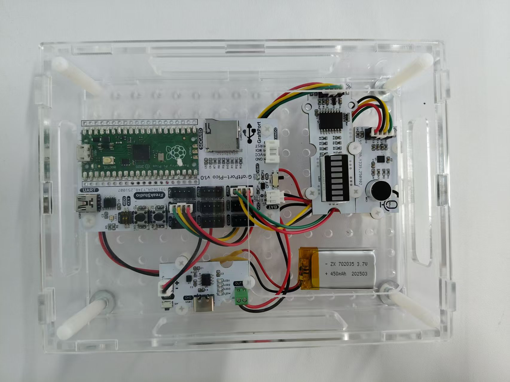

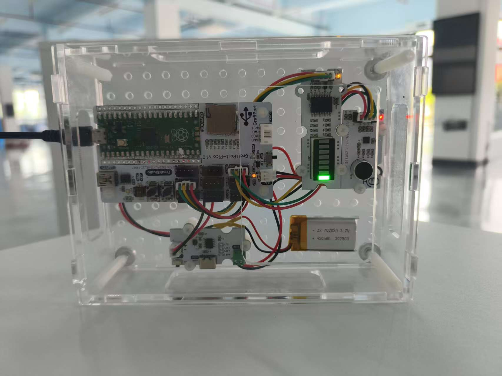


# 目录
- [1. 简介](#1简介)
- [2. 主要功能](#2主要功能)
- [3. 硬件要求](#3硬件要求)
- [4. 软件环境](#4软件环境)
- [5. 文件结构](#5文件结构)
- [6. 关键文件说明](#6关键文件说明)
- [7. 软件设计核心思想](#7软件设计核心思想)
- [8. 使用说明](#8使用说明)
- [9. 示例程序](#9示例程序)
- [10. 注意事项](#10注意事项)
- [11. 版本记录](#11版本记录)
- [12. 联系开发者](#12联系开发者)
- [13. 许可协议](#13许可协议)
# **项目说明**

## **1.简介**

### **1.1 项目背景**

本项目**基于 GraftPort-RP2040 开发板**，结合**基于 MAX9814 的驻极体电容式麦克风模块**和**基于 PCF8574 芯片的八段光条数码管模块**，实现"音频能量采集-显示"一体化系统，融入 `MicroPython` 的轻量化任务调度与异常处理机制，保证系统稳定运行。

### **1.2 项目主要功能概览**

本项目基于 `MicroPython` 开发，核心功能是通过**基于 MAX9814 的驻极体电容式麦克风模块**实时采集音频信号，通过音频频率分析器计算音频能量，然后通过**基于 PCF8574 芯片的八段光条数码管模块**显示音频能量等级；支持板载按键中断切换任务启停，内置自动垃圾回收（`GC`）避免内存泄漏，异常捕获与限速打印便于问题定位。

### **1.3 适用场景或应用领域**

- **音乐可视化**：实时显示音频能量，用于音乐播放时的视觉辅助；
- **环境监测：** 作为简易的声级计，用于环境噪声监测；
- **教学演示：** 用于 `MicroPython` 任务调度、`ADC` 数据采集、`I2C` 通信、音频分析等知识点的实践教学；
- **智能家居：** 集成到智能家居设备中，提供声光互动功能。

## 2.主要功能

- **实时音频能量检测**：通过**基于 MAX9814 的驻极体电容式麦克风模块**每 10ms 采集一次音频信号，计算音频能量；
- **LED 条形灯实时显示**：通过**基于 PCF8574 芯片的八段光条数码管模块**实时显示当前音频能量等级，共 8 级；
- **按键中断交互：** 板载按键触发下降沿中断，可切换核心任务"运行/暂停"，暂停时停止数据采集和显示更新；
- **自动内存管理：** 空闲时检测内存，若低于阈值自动触发 `GC`，防止 `MicroPython` 因内存泄漏崩溃；
- **异常容错机制**：任务执行抛异常时，完整打印回溯信息并限速，避免刷屏；
- **板级适配灵活**：基于 `board.py` 实现引脚映射解耦，支持后续扩展其他 `RP2040` 开发板。

## 3.硬件要求

### 3.1 需要硬件

项目基于 **GraftPort-RP2040 开发板**作为主控：

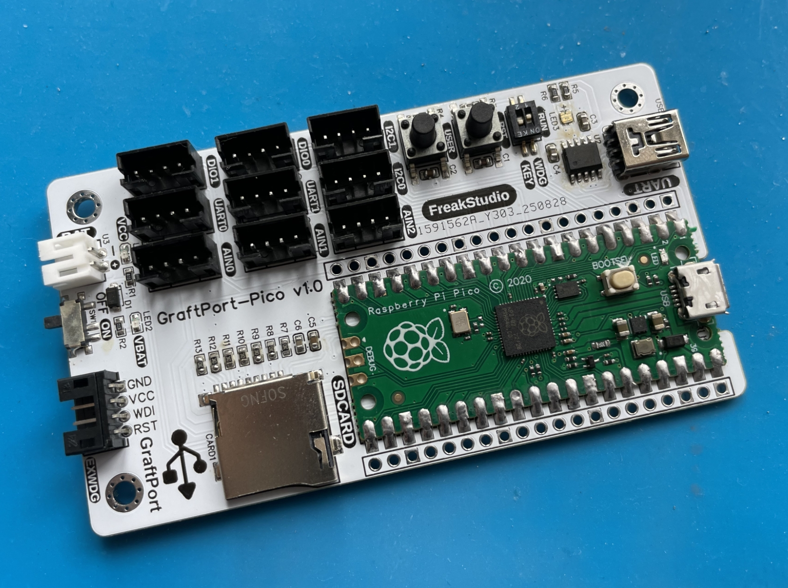

**其余需要的模块包括：**


- **基于 MAX9814 的驻极体电容式麦克风模块**（模拟输出，连接 `ADC` 引脚；数字输出，连接 `GPIO` 引脚用于控制增益）；
- **基于 PCF8574 芯片的八段光条数码管模块**（`I2C` 通信，地址 `0x20~0x27`）；
- **SY7656 锂电池充放电模块**（连接聚合物锂电池，输出 5V 电压，带 `Type-C` 充电接口）；
- **板载按键：** 默认使用开发板固定引脚（`引脚18`，上拉输入），无需额外接线。
- **板载 LED：** 默认使用开发板固定引脚（`引脚25`），无需额外接线。

### 3.2 **硬件连线**

**基于 MAX9814 的驻极体电容式麦克风模块：** 通过 `PH2.0` 连接线接入 `ADC0` 接口（模拟输入)

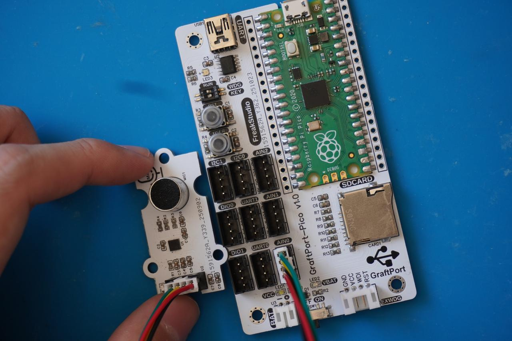

**基于 PCF8574 芯片的八段光条数码管模块模块：** 通过 `PH2.0` 连接线接入 `I2C0` 接口;

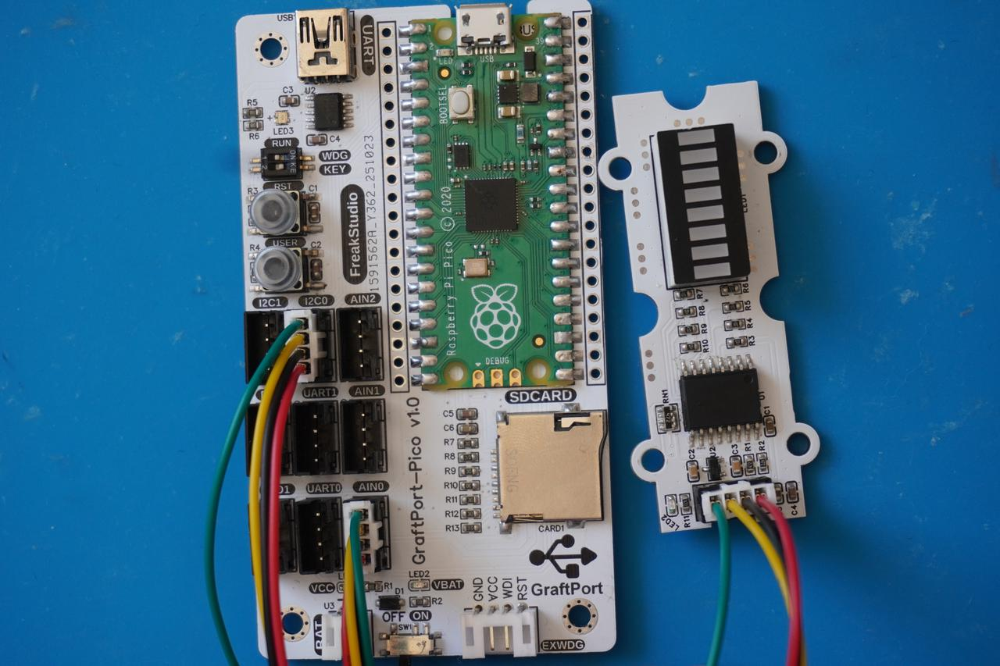

**锂电池充放电模块**：`BAT` 接口连接锂电池，`OUT` 接口通过 `PH2.0-2P` 连接线为主控板供电。

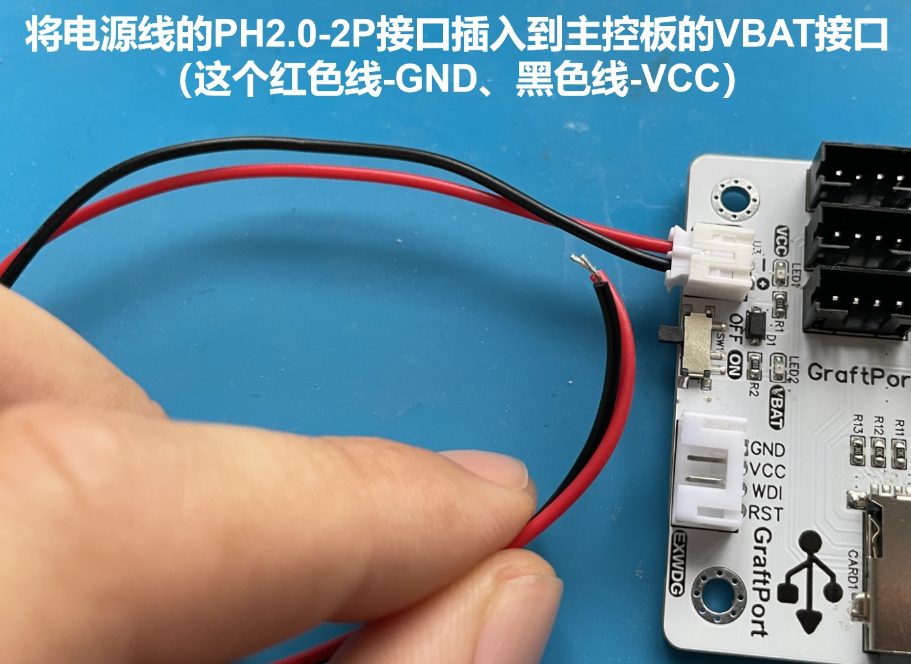


### 3.3 结构装配

**首先，使用 M3 塑料柱将各模块与主控板固定在外壳底板上（主控板与外壳均预留 M3 螺丝孔）**：

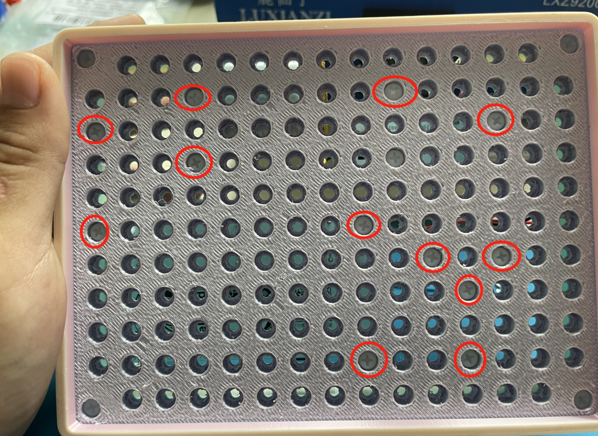


**接着，利用 M3 塑料柱将外壳四周固定好，并在对应位置拧上 M3 螺丝完成装配**：


### 3.4 注意事项

**在主控板不连接外部看门狗模块时，`RUN` 拨码开关 2 要导通**：


**锂电池充放电模块支持电量显示，使用下面**`Type-C`**接口即可充电**：


## 4.软件环境

- **核心固件：**`MicroPython v1.23.0`（需适配 **GraftPort-RP2040**，支持 `machine.Pin/I2C/UART/ADC/Timer` 模块）；
- **开发 IDE：**`PyCharm`（用于代码编写、上传、调试，支持 `MicroPython REPL` 交互）；
- **辅助工具：**

  - `Python 3.12+`（用于运行本地辅助脚本，可选）；
  - `mpy-cross v1.23.0`（用于将 `.py` 文件编译为 `.mpy`，减少开发板内存占用，可选）；
  - `mpremote v0.11.0+`（替代 `Thonny` 上传文件，支持命令行操作，可选）；
- **依赖模块**：无额外第三方库，所有驱动均为自定义实现，随项目文件提供。

## 5.文件结构

```
audio_responsive_light
├─ .flake8
├─ LICENSE
├─ README.md
├─ tools
│  ├─ dependency_analyzer.py
│  ├─ mpy_compiler.py
│  ├─ mpy_uploader.py
│  └─ README.md
├─ firmware
│  ├─ board.py
│  ├─ boot.py
│  ├─ conf.py
│  ├─ main.py
│  ├─ tasks
│  │  ├─ maintenance.py
│  │  ├─ sensor_task.py
│  │  └─ __init__.py
│  ├─ libs
│  │  ├─ __init__.py
│  │  ├─ TFT_mic
│  │  └─ scheduler
│  └─ drivers
│     ├─ __init__.py
│     ├─ pcf8574_led_driver
│     └─ max9814_mic_driver
└─ examples
   └─ README.md
```

## 6.关键文件说明

- `main.py`：**项目入口，核心逻辑包括**：

  1. 上电延时 3 秒（等待硬件稳定），初始化板载 `LED`、`MAX9814` 麦克风、`PCF8574` 芯片、按键（含中断注册）；
  2. **硬件初始化**：**基于 MAX9814 的驻极体电容式麦克风模块**、**基于 PCF8574 芯片的八段光条数码管模块**；
  3. 创建 `sensor_task` 实例（传入音频分析器和 `LED` 条形灯实例与配置参数），封装为调度器任务（周期 10ms）；
  4. 初始化 `Scheduler`（软定时器，调度周期 5ms），添加任务并启动调度，进入无限循环；
  5. 定义 `button_handler` 中断回调（切换任务启停）、`fatal_hang` 阻塞函数（严重错误处理）。
- `tasks/sensor_task.py`：**核心业务任务，**`micTask` **类关键逻辑**：

  1. `__init__`：初始化音频分析器和 `LED` 条形灯实例；
  2. `tick`：每 10ms 执行一次，流程为"读取麦克风信号 → 分析音频能量 →`LED` 条形灯更新显示"；
- `tasks/maintenance.py`：**系统维护模块，关键函数**：

  1. `task_idle_callback`：调度器空闲时触发，检测内存低于 `GC_THRESHOLD_BYTES`（默认 100000 字节）则执行 `gc.collect()`；
  2. `task_err_callback`：任务抛异常时触发，打印完整回溯信息（优先 `sys.print_exception`），并延时 `ERROR_REPEAT_DELAY_S`（默认 1 秒）防止刷屏；
  3. 支持从 `conf.py` 读取配置，无配置时使用默认值，保证兼容性。
- `drivers/xxx_driver`：**硬件驱动模块，均采用"实例化 + 方法调用"模式，仅暴露与硬件相关的控制接口，屏蔽底层细节**：

  - `max9814_mic_driver`：`MAX9814Mic` 类通过 `ADC` 读取模拟电压值，通过 `Pin` 控制增益，提供 `read_normalized` 方法读取归一化的音频信号；
  - `pcf8574_led_driver`：`PCF8574` 类通过 `I2C` 控制 `PCF8574` 芯片，`LEDBar` 类提供 `display_level` 方法控制 `LED` 条形灯的显示等级。
- `libs/TFT_mic.py`：**音频频率分析器，**`AudioFrequencyAnalyzer` **类关键逻辑**：

  1. **初始化**：传入 `MAX9814Mic` 实例，设置采样参数；
  2. `sample_and_analyze`：采集一段音频信号，计算能量（或其他特征）。
- `board.py`：板级引脚映射模块，定义 `BOARDS` 字典（含 `GraftPort-RP2040` 的固定引脚、`I2C`/`DIO`/`ADC` 接口映射），提供 `get_fixed_pin`、`get_i2c_pins` 等接口，实现"板级配置与业务逻辑解耦"，后续扩展其他开发板只需添加 `BOARDS` 子项。
- `conf.py`：**用户配置文件，需用户手动定义的参数包括**：`I2C_INIT_MAX_ATTEMPTS`（传感器初始化重试次数）、`I2C_INIT_RETRY_DELAY_S`（重试间隔秒数）、`ENABLE_DEBUG`（调试打印开关）、`AUTO_START`（任务是否自动启动），无定义时系统使用默认值。

## 7.软件设计核心思想

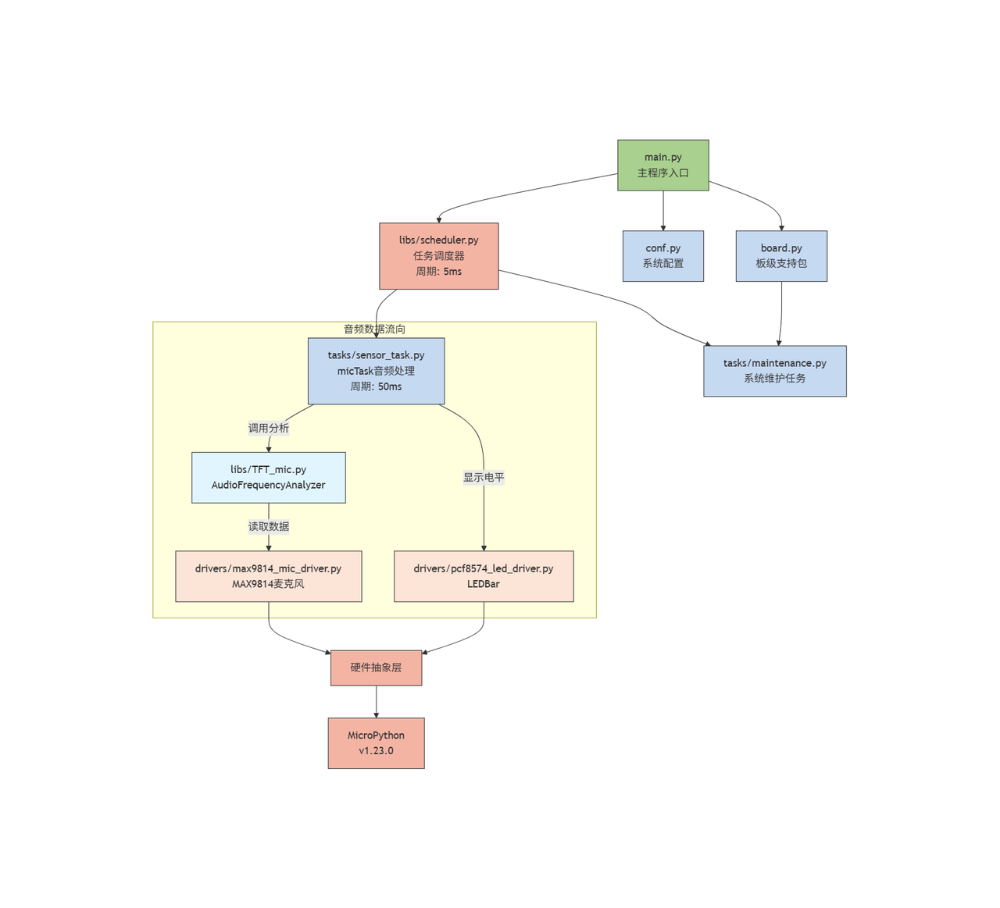

- **系统分层思路**：采用"四层架构"，实现解耦与复用

  - **硬件驱动层（**`drivers/`**）**：仅负责硬件的底层控制，不包含业务逻辑，如麦克风驱动只关心"如何获取音频信号"，不关心"何时显示"。
  - **任务逻辑层（**`tasks/`**）**：基于驱动层提供的接口实现业务逻辑，如 `micTask` 只调用驱动的 `read_normalized` 方法获取数据，不关心麦克风的 ADC 引脚；只调用 `display_level` 显示等级，不关心 `LED` 的 `I2C` 配置。
  - **调度控制层（**`libs/scheduler.py`**）**：提供通用的任务管理能力，支持任务添加/暂停/恢复、空闲/异常回调，不依赖具体业务；通过软定时器统一管理所有任务的执行时机，确保系统资源合理分配。
  - **入口层（**`main.py`**）**：负责"组装"各层，初始化硬件 → 创建任务 → 启动调度，是系统的"胶水"，不包含核心业务逻辑；处理硬件异常和用户交互，确保系统稳定启动和运行。
- **模块划分原则**：高内聚、低耦合，便于维护与扩展

  - **高内聚**： 每个模块只负责单一职责，如 `maintenance.py` 仅处理系统维护（`GC`、异常），不涉及数据显示；`sensor_task.py` 仅处理音频数据采集和显示逻辑，不关心硬件初始化；每个驱动模块仅封装对应硬件的控制方法。
  - **低耦合**： 模块间通过"接口"交互，而非直接操作内部变量，如 `micTask` 通过 `AudioFrequencyAnalyzer.sample_and_analyze()` 获取能量，不直接访问 `ADC` 寄存器；通过 `LEDBar.display_level()` 显示等级，不直接操作 `I2C` 硬件。
  - **扩展性**： 新增硬件（如其他传感器）时，只需在 `drivers/` 添加对应驱动，在 `tasks/` 创建新任务，无需修改现有代码；扩展开发板时，只需在 `board.py` 添加引脚映射，不影响业务逻辑；新增显示内容时，只需修改 `micTask` 的显示逻辑，不涉及硬件层改动。
- **核心机制**： 保障系统稳定与用户体验

  - **任务调度机制**： 基于软定时器 `（Timer(-1)）` 实现，调度周期 5ms，核心任务周期 10ms，通过"计数器累加"判断任务是否到执行时间，避免定时器嵌套冲突；支持任务动态暂停和恢复，响应用户操作。
  - **数据更新机制**： 采用"实时更新"策略，每 10ms 更新一次 `LED` 显示，保证显示的实时性；同时，通过音频能量分析，将能量映射到 8 个 `LED` 等级，直观显示。
  - **交互反馈机制**： 按键中断回调"即时生效"，暂停时立即停止数据采集和显示更新，避免用户操作后无响应；传感器初始化失败时"明确报错"（`LED` 闪烁 + 终端信息），便于定位硬件连接问题。
  - **容错机制**： 所有关键操作（如硬件控制、数据读取）均用 `try-except` 包裹，避免单一模块故障导致整个系统崩溃，如麦克风读取失败不影响任务调度运行；自动内存回收机制防止长时间运行的内存泄漏。
  - **任务执行板块:**
    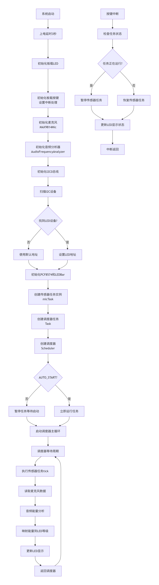

## 8.使用说明

### **8.1 硬件连接**

按“硬件要求”中的连接方式，连接主控板、各个传感器模块和电池；

### **8.2 运行项目（使用 **`PyCharm + MicroPython`** 插件）**

打开 `PyCharm ` 并安装对应的 `MicroPython` 插件。


在插件中选择 **运行设备（**`Target Device`**）** 为 `RP2040`，并启用 **自动检测设备路径（**`Auto-detect device path`**）**。


将 `Project/firmware ` 设置为项目根目录。


**修改运行配置**：

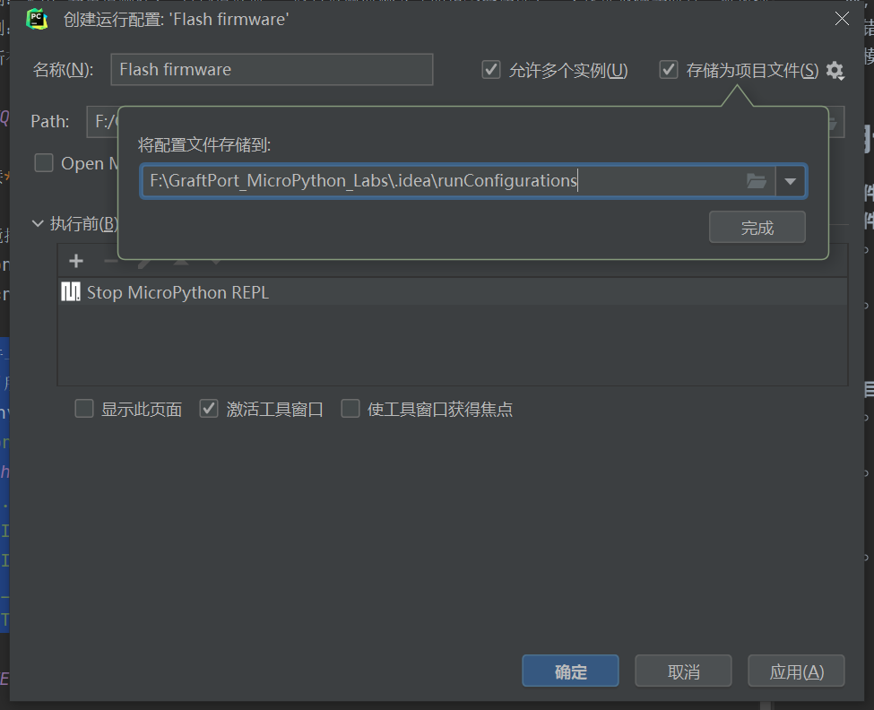

- 勾选 **允许多个实例（**`Allow multiple instances`**）**
- 选择 **存储为项目文件（**`Store as project file`**）**
- 点击 **确定** 保存配置。

点击 `IDE` 右上角的绿色三角按钮运行，即可开始上传固件并执行项目。


### **8.3 运行配置的修改**

**您可以配置 **`conf.py`**，根据需求修改或添加参数，例如**：

```python
# conf.py 示例配置
ENABLE_DEBUG = True            # 是否开启调试打印
AUTO_START = True              # 是否在启动时自动运行任务
```

### **8.4 功能测试**

**音频能量检测**：在麦克风附近发出不同强度的声音，观察 `LED` 条形灯显示是否相应变化；


**按键切换：** 按下板载按键，任务暂停（停止数据采集和显示更新），再次按下恢复。

**终端输出结果如下所示**：

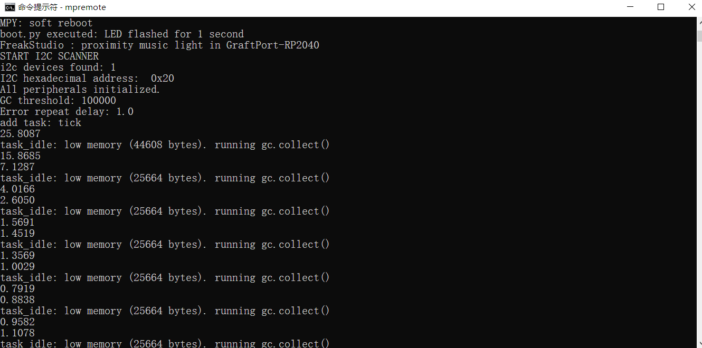

### **8.5 调试与问题定位**

- 若 `I2C` 设备不响应，检查硬件连接、电源、`I2C` 地址配置；
- 若 `PCF8574` `LED` 不亮，检查 `I2C` 地址是否正确（`0x20`~`0x27`），使用 `I2C` 扫描确认设备地址；
- 若 `MAX9814` 麦克风无数据，检查 `ADC` 引脚连接、增益控制引脚配置；

## 9.示例程序

本项目没有其余参考示例代码，直接在 `firmware` 文件夹中进行修改即可。

## 10.注意事项

- **传感器相关**：

  - **基于 MAX9814 的驻极体电容式麦克风模块**需要适当的声压条件，避免在极高声压下使用；
  - 麦克风应避免长时间暴露在极高声压下，以免损坏。
- **硬件连接相关**：

  - **基于 PCF8574 芯片的八段光条数码管模块**的 `I2C` 地址可能为 `0x20~0x27`，系统会自动扫描并使用第一个找到的地址；
- **软件版本相关**：

  - 必须使用 `MicroPython v1.23.0` 及以上版本；
  - 调试打印会占用一定内存，正式使用时建议关闭。
- **功能使用相关**：

  - 任务周期（10ms）不建议修改过小，否则可能增加系统负载；
  - 自动 `GC` 阈值建议根据实际内存使用情况调整。

## 11.版本记录

- **v1.0.0 (2025-10-10)：侯钧瀚初始版本**：
  - 支持 `MAX9814` 实时音频能量检测；
  - 实现**基于 PCF8574 芯片的八段光条数码管模块**实时显示；
  - 支持按键中断切换任务启停；
  - 适配 **GraftPort-RP2040 开发板**。

## 12.联系开发者

**如有任何问题或需要帮助，请通过以下方式联系开发者**：
📧 **邮箱**：<u>10696531183@qq.commailto:10696531183@qq.com</u>
💻 **GitHub**：<u>[https://github.com/FreakStudioCN](https://github.com/FreakStudioCN)</u>

## 13.许可协议

本项目中，除 `machine` 等 `MicroPython` 官方模块（`MIT` 许可证）外，所有由作者编写的驱动与扩展代码均采用 **知识共享署名-非商业性使用 4.0 国际版 (CC BY-NC 4.0)** 许可协议发布。

**您可以自由地**：

- **共享** — 在任何媒介以任何形式复制、发行本作品
- **演绎** — 修改、转换或以本作品为基础进行创作

**惟须遵守下列条件**：

- **署名** — 您必须给出适当的署名，提供指向本许可协议的链接，同时标明是否（对原始作品）作了修改。您可以用任何合理的方式来署名，但是不得以任何方式暗示许可人为您或您的使用背书。
- **非商业性使用** — 您不得将本作品用于商业目的。
- **合理引用方式** — 可在代码注释、文档、演示视频或项目说明中明确来源。

**版权归 FreakStudio 所有。**

# 附件一：项目源代码下载

# 附件二：硬件模块参考资料

[GraftPort-RP2040 开发板](https://f1829ryac0m.feishu.cn/docx/ZHdjdPdCwonbLyxVeAdcehG4n8b?from=from_copylink)

# 版本记录

<table>
<tr>
<td>文档版本<br/></td><td>修改日期<br/></td><td>修改人<br/></td><td>修改内容<br/></td></tr>
<tr>
<td>V1.0.0<br/></td><td>2025-11-03<br/></td><td>侯钧瀚<br/></td><td>编写文档初稿。<br/></td></tr>
<tr>
<td><br/></td><td><br/></td><td><br/></td><td><br/></td></tr>
</table>
