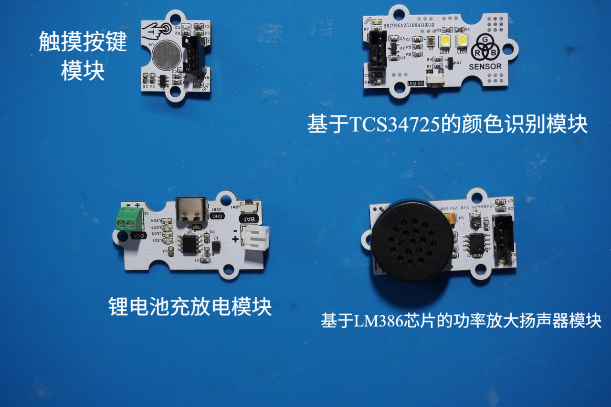
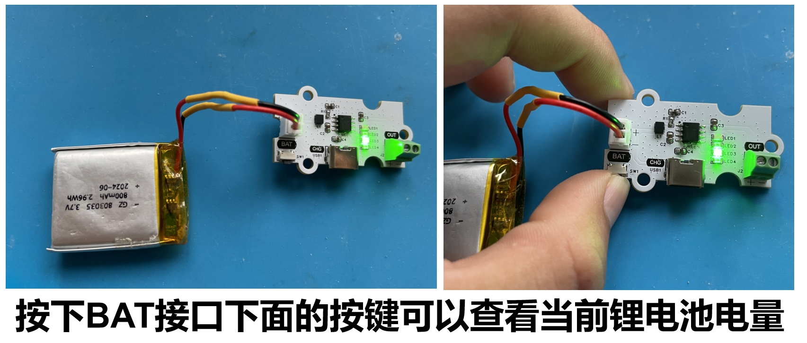
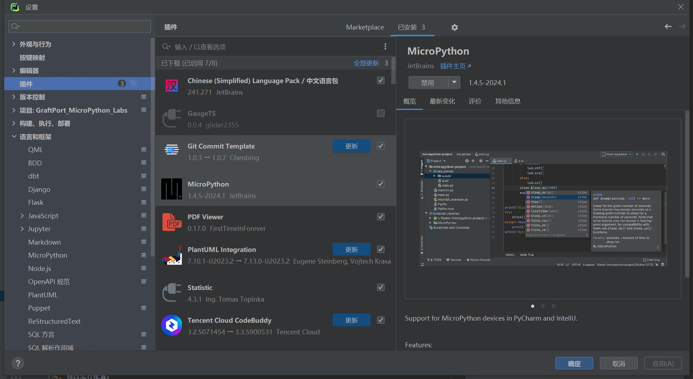

# 颜色识别联动式声光反馈装置（基于 GraftPort-RP2040 开发板）


 

# 目录
- [1. 简介](#1简介)
- [2. 主要功能](#2主要功能)
- [3. 硬件要求](#3硬件要求)
- [4. 软件环境](#4软件环境)
- [5. 文件结构](#5文件结构)
- [6. 关键文件说明](#6关键文件说明)
- [7. 软件设计核心思想](#7软件设计核心思想)
- [8. 使用说明](#8使用说明)
- [9. 示例程序](#9示例程序)
- [10. 注意事项](#10注意事项)
- [11. 版本记录](#11版本记录)
- [12. 联系开发者](#12联系开发者)
- [13. 许可协议](#13许可协议)
# **项目说明**

## **1.简介**

### **1.1 项目背景**

传统的声音播放设备多为固定音调或预设音乐，缺乏与环境的实时交互能力。本项目**基于 GraftPort-RP2040 开发板**，结合**基于 TCS34725 的颜色识别模块**、**基于 LM386 芯片的功率放大扬声器模块**和**基于 TTP223 的触摸按键模块**，实现"`RGB` 颜色识别-音调转换-实时播放"的交互式音乐系统，解决传统音频设备交互单一的问题，同时融入 `MicroPython` 的异步任务处理与防抖机制，保证系统响应实时性。

### 1.2 项目主要功能概览

本项目基于 `MicroPython` 开发，核心功能是通过**基于 TCS34725 的颜色识别模块**实时采集颜色数据，转换为对应频率的音调，通过**基于 LM386 芯片的功率放大扬声器模块**播放音调序列；支持**基于 TTP223 的触摸按键模块**控制采集启停，内置异步播放避免阻塞主循环，完整的异常处理机制保证系统稳定运行。

### **1.3 适用场景或应用领域**

- **音乐教育**：通过颜色识别生成对应音调，用于音乐启蒙教育；
- **艺术装置**：将视觉艺术转换为听觉体验的交互装置；
- **教学演示**：用于 `MicroPython` 异步编程、`I2C` 通信、`PWM` 音频输出等知识点的实践教学；
- **娱乐互动**：开发颜色识别音乐游戏或创意乐器。

## 2.主要功能

- **实时 RGB 颜色采集：** 通过**基于 TCS34725 的颜色识别模块**采集 `RGB` 颜色数据，支持原始数据读取；
- **颜色-音调转换：** 根据 `RGB` 分量最大值映射到不同频率音调（红 →`500Hz`，绿 →`1000Hz`，蓝 →`1500Hz`，其他 →`2000Hz`）；
- **触摸按键交互：** 触摸按键按下时持续采集颜色数据，松开后播放音调序列；
- **播放中断控制：** 播放过程中按下按键立即停止播放并开始新的采集；
- **防抖机制：** 按键检测采用软件防抖，确保操作准确性；
- **异常容错机制：** 关键操作均包含异常处理，传感器读取失败时自动重置采集状态。

## 3.硬件要求

### 3.1 需要硬件

项目**基于 GraftPort-RP2040 开发板**作为主控：


- **基于 TCS34725 的颜色识别模块：**（`I2C` 通信，地址 `0x29-0x3E`）；
- **基于 LM386 芯片的功率放大扬声器模块：**（`PWM` 输出，连接 `DIO` 引脚）；
- **触摸按键模块：**（数字输入，连接 `DIO` 引脚）；
- **板载 LED：** 用于状态指示（引脚 25）；
- **板载按键：** 用于任务启停控制（引脚 18，上拉输入）。

**其余需要的模块包括：**



- **基于 TCS34725 的颜色识别模块**：通过 `PH2.0` 连接线接入 `I2C0` 接口；
- **基于 LM386 芯片的功率放大扬声器模块：** 通过 `PH2.0` 连接线接入 `DIO1` 接口；
- **触摸按键模块：** 通过 `PH2.0` 连接线接入 `DIO0` 接口。

### 3.2 **硬件连线**

**基于 TCS34725 的颜色识别模块**：通过 `PH2.0` 连接线接入 `I2C0` 接口；


**基于 LM386 芯片的功率放大扬声器模块：** 通过 `PH2.0` 连接线接入 `DIO1` 接口；


**触摸按键模块：** 通过 `PH2.0` 连接线接入 `DIO0` 接口。


**锂电池充放电模块**：`BAT` 接口连接锂电池，`OUT` 接口通过 `PH2.0-2P` 连接线为主控板供电。


### 3.3 结构装配

**首先，使用 M3 塑料柱将各模块与主控板固定在外壳底板上（主控板与外壳均预留 M3 螺丝孔）：**


**接着，利用 M3 塑料柱将外壳四周固定好，并在对应位置拧上 M3 螺丝完成装配：**


### 3.4 注意事项

**在主控板不连接外部看门狗模块时，RUN 拨码开关 2 要导通：**


**锂电池充放电模块支持电量显示，使用下面****Type-C****接口即可充电：**



## 4.软件环境

- **核心固件：**`MicroPython v1.23.0`（需适配 `GraftPort-RP2040`，支持 `machine.Pin/I2C/Timer` 模块、软定时器调度）；
- **开发 IDE：**`PyCharm`（用于代码编写、上传、调试，支持 `MicroPython REPL` 交互，需要安装 `MicroPython` 插件）；
- **辅助工具：**

  - `Python 3.12+`（用于运行本地辅助脚本，如固件烧录脚本，可选）；
  - `mpy-cross v1.23.0`（用于将 `.py` 文件编译为 `.mpy`，减少开发板内存占用，可选）；
  - `mpremote v0.11.0+`（替代 `Thonny` 上传文件，支持命令行操作，可选）；
- **依赖模块：** 无额外第三方库，所有驱动（`passive_buzzer_driver.py` 等）均为自定义实现的，随项目文件提供。

## 5.文件结构
```
color_recognition_audio
├─ .flake8
├─ LICENSE
├─ README.md
├─ tools
│  ├─ dependency_analyzer.py
│  ├─ mpy_compiler.py
│  ├─ mpy_uploader.py
│  └─ README.md
├─ firmware
│  ├─ board.py
│  ├─ boot.py
│  ├─ conf.py
│  ├─ main.py
│  ├─ tasks
│  │  ├─ maintenance.py
│  │  ├─ sensor_task.py
│  │  └─ __init__.py
│  ├─ libs
│  │  ├─ __init__.py
│  │  └─ scheduler
│  └─ drivers
│     ├─ __init__.py
│     ├─ tcs34725_color_driver
│     ├─ passive_buzzer_driver
│     └─ button_driver
├─ examples
└─ docs
```

## 6.关键文件说明

- **main.py：项目入口，核心逻辑包括：**

  1. 上电延时 3 秒（等待硬件稳定），初始化板载 `LED`、`I2C` 总线、**基于 TCS34725 的颜色识别模块**、LM386 扬声器、触摸按键（含中断注册）；
  2. 硬件初始化：`I2C0` 总线扫描识别 `TCS34725` 地址，初始化**基于 TCS34725 的颜色识别模块**、扬声器、触摸按键；
  3. 创建 `sensor_task` 实例（传入硬件驱动与配置参数），封装为调度器任务（周期 200ms）；
  4. 初始化 `Scheduler`（软定时器，调度周期 50ms），添加任务并启动调度，进入无限循环；
  5. 定义 `button_handler` 中断回调（切换任务启停）、`fatal_hang` 阻塞函数（严重错误处理）。
- **tasks/sensor_task.py ：核心业务任务，****SensorRGBSoundTask****类关键逻辑：**

  1. `__init__`：初始化硬件实例和状态变量（`_pressed`、`_reading`、`_sequence`、`_is_playing` 等）；
  2. `tick`：每 200ms 执行一次，流程为"检测触摸状态 →RGB 数据采集 → 颜色频率转换 → 异步音调播放"；
  3. `_color_to_freq`：`RGB` 颜色到频率映射算法（红 →`500Hz`，绿 →`1000Hz`，蓝 →`1500Hz`，其他 →`2000Hz`）；
  4. `_stop_playback`：停止当前播放，重置播放状态标志；
  5. `_play_async`：异步播放音调序列，避免阻塞主循
- **tasks/maintenance.py：系统维护模块，关键函数：**

  1. `task_idle_callback`：调度器空闲时触发，检测内存低于 `GC_THRESHOLD_BYTES`（默认 100000 字节）则执行 `gc.collect()`；
  2. `task_err_callback`：任务抛异常时触发，打印完整回溯信息（优先 `sys.print_exception`），并延时 `ERROR_REPEAT_DELAY_S`（默认 1 秒）防止刷屏；
  3. 支持从 `conf.py` 读取配置，无配置时使用默认值，保证兼容性。
- **drivers/xxx_driver：硬件驱动模块，均采用"实例化 + 方法调用"模式，仅暴露与硬件相关的控制接口，屏蔽底层细节：**

  - `tcs34725_color_driver`：`TCS34725` 类通过 `I2C` 通信，`read` 方法读取 `RGB` 颜色原始数据；
  - `lm386_speaker_driver`：`LMSpeaker` 类通过 `PWM` 控制音调输出，提供 `play_sequence`、`stop` 等方法；
  - `button_driver`：`TouchKey` 类检测触摸状态，`get_state` 方法返回按键状态，内置防抖处理。
- **board.py**：板级引脚映射模块，定义 `BOARDS` 字典（含 `GraftPort-RP2040` 的固定引脚、`I2C`/`DIO` 接口映射），提供 `get_fixed_pin`、`get_i2c_pins`、`get_dio_pins` 等接口，实现"板级配置与业务逻辑解耦"，后续扩展其他开发板只需添加 `BOARDS` 子项。
- **conf.py**：**用户配置文件，需用户手动定义的参数包括**：`I2C_INIT_MAX_ATTEMPTS`（传感器初始化重试次数）、`I2C_INIT_RETRY_DELAY_S`（重试间隔秒数）、`ENABLE_DEBUG`（调试打印开关）、`AUTO_START`（任务是否自动启动），无定义时系统使用默认值。

## 7.软件设计核心思想


- **系统分层思路**：采用”四层架构”，实现解耦与复用

  - **硬件驱动层（****drivers/****）：**仅负责硬件的底层控制，不包含业务逻辑，如**基于 TCS34725 的颜色识别模块**驱动只关心”如何获取 `RGB` 数据”，不关心”何时播放音调”；`LM386` 扬声器驱动只关心”如何播放音调序列”，不关心”音调频率来源”；触摸按键驱动只关心”如何检测触摸状态”，不关心”触摸后的业务逻辑”。
  - **任务逻辑层（****tasks/****）：** 基于驱动层提供的接口实现业务逻辑，如 `SensorRGBSoundTask` 只调用 `TCS34725.read()` 获取颜色数据，不关心传感器的 `I2C` 地址；只调用 `LMSpeaker.play_sequence()` 播放音调，不关心 `PWM` 的引脚配置；只调用 `TouchKey.get_state()` 检测按键状态，不关心触摸检测的硬件实现。
  - **调度控制层（****libs/scheduler.py****）：** 提供通用的任务管理能力，支持任务添加/暂停/恢复、空闲/异常回调，不依赖具体业务；通过软定时器统一管理所有任务的执行时机，确保系统资源合理分配。
  - **入口层（****main.py****）：** 负责”组装”各层，初始化硬件 → 创建任务 → 启动调度，是系统的”胶水”，不包含核心业务逻辑；处理硬件异常和用户交互，确保系统稳定启动和运行。
- **模块划分原则**：高内聚、低耦合，便于维护与扩展

  - **高内聚**：每个模块只负责单一职责，如 `maintenance.py` 仅处理系统维护（`GC`、异常），不涉及颜色采集；`sensor_task.py` 仅处理 `RGB` 数据采集和音调播放逻辑，不关心硬件初始化；每个驱动模块仅封装对应硬件的控制方法。
  - **低耦合**：模块间通过”接口”交互，而非直接操作内部变量，如 `SensorRGBSoundTask` 通过 `TCS34725.read()` 获取数据，不直接操作 `I2C` 寄存器；通过 `LMSpeaker.play_sequence()` 播放音调，不直接控制 `PWM` 硬件；通过 `TouchKey.get_state()` 检测状态，不直接读取 `GPIO` 电平。
  - **扩展性**：新增硬件（如光线传感器）时，只需在 `drivers/` 添加对应驱动，在 `tasks/` 创建新任务，无需修改现有代码；扩展开发板时，只需在 `board.py` 添加引脚映射，不影响业务逻辑；新增播放模式时，只需修改 `SensorRGBSoundTask` 的音调映射逻辑，不涉及硬件层改动。
- **核心机制**：保障系统稳定与用户体验

  - **任务调度机制**：基于软定时器（`Timer(-1)`）实现，调度周期 50ms，核心任务周期 200ms，通过”计数器累加”判断任务是否到执行时间，避免定时器嵌套冲突；支持任务动态暂停和恢复，响应用户操作。
  - **异步播放机制**：采用”线程分离”策略，音调序列播放在单独线程中执行，既避免阻塞主循环（确保实时响应触摸按键），又保证音调播放的完整性；通过状态标志位协调播放线程与主线程的同步。
  - **交互反馈机制**：触摸按键”即时响应”，按下时立即开始 `RGB` 数据采集，松开后立即启动音调播放；板载按键中断回调”即时生效”，暂停时立即停止所有音频输出，避免用户操作后无响应；传感器初始化失败时”明确报错”（`LED` 闪烁 + 终端信息），便于定位硬件连接问题。
  - **容错机制**：所有关键操作（如硬件控制、数据读取）均用 `try-except` 包裹，避免单一模块故障导致整个系统崩溃，如颜色传感器读取失败不影响任务调度运行；音频播放异常不影响触摸按键检测；自动内存回收机制防止长时间运行的内存泄漏；防抖机制确保触摸检测的准确性。
- **任务执行流程：任务执行流程如下所示**：


## 8.使用说明

### **8.1 硬件连接**

按“硬件要求”中的连接方式，连接主控板、各个传感器模块和电池；

### **8.2 运行项目（使用 PyCharm + MicroPython 插件）**

打开 `PyCharm` 并安装对应的 `MicroPython` 插件。



在插件中选择 **运行设备（**`Target Device`**）** 为 `RP2040`，并启用 **自动检测设备路径（**`Auto-detect device path`**）**。


将`Project/firmware` 设置为项目根目录。


**修改运行配置**：


- 勾选 **允许多个实例（**`Allow multiple instances`**）**
- 选择 **存储为项目文件（**`Store as project file`**）**
- 点击 **确定** 保存配置。

点击 `IDE` 右上角的绿色三角按钮运行，即可开始上传固件并执行项目。


### **8.3 运行配置的修改**

**您可以配置** `conf.py`，**根据需求修改或添加参数，例如：**

```python
# conf.py 示例配置
I2C_INIT_MAX_ATTEMPTS = 3      # 传感器初始化最多重试次数
I2C_INIT_RETRY_DELAY_S = 0.5   # 每次重试间隔（秒）
ENABLE_DEBUG = True            # 是否开启调试打印
AUTO_START = True              # 是否在启动时自动运行任务
```

### **8.4 功能测试**

- **颜色采集**：将不同颜色物体置于传感器前，观察终端输出的 `RGB` 值和识别结果；


- **音调播放**：松开触摸按键后应播放对应音调序列；
- **中断控制**：播放过程中按下触摸按键应立即停止播放；
- **任务控制**：板载按键可切换任务运行/暂停状态。

**终端输出结果如下所示：**


### **8.5 调试与问题定位**

- 若功能异常，确保 `ENABLE_DEBUG=True` 查看调试信息；
- 若传感器初始化失败，检查 `I2C` 连接和地址；
- 若无声音输出，检查扬声器模块连接和 `PWM` 配置。

## 9.示例程序

本项目没有其余参考示例代码，直接在 `firmware` 文件夹中进行修改即可。

## 10.注意事项

- **传感器相关：**`TCS34725` 需要适当光照条件，避免强光直射；
- **音频相关：**`LM386` 模块音量不宜过大，避免失真；
- **线程安全：** 异步播放时注意状态变量同步；
- **电源要求：** 确保供电稳定，避免音频播放时电压跌落。

## 11.版本记录

- **v1.0.0 (2025-10-10)：** 实现基本功能
  - 支持 `RGB` 颜色实时采集和音调转换
  - 实现触摸按键控制和异步播放
  - 完整的异常处理和状态管理

## 12.联系开发者

**如有任何问题或需要帮助，请通过以下方式联系开发者：**
📧 **邮箱**：<u>10696531183@qq.com</u>
💻 **GitHub**：<u>[https://github.com/FreakStudioCN](https://github.com/FreakStudioCN)</u>

## 13.许可协议

本项目中，除 `machine` 等 `MicroPython ` 官方模块（`MIT` 许可证）外，所有由作者编写的驱动与扩展代码均采用 **知识共享署名-非商业性使用 4.0 国际版 (CC BY-NC 4.0)** 许可协议发布。

**您可以自由地：**

- **共享** — 在任何媒介以任何形式复制、发行本作品
- **演绎** — 修改、转换或以本作品为基础进行创作

**惟须遵守下列条件：**

- **署名** — 您必须给出适当的署名，提供指向本许可协议的链接，同时标明是否（对原始作品）作了修改。您可以用任何合理的方式来署名，但是不得以任何方式暗示许可人为您或您的使用背书。
- **非商业性使用** — 您不得将本作品用于商业目的。
- **合理引用方式** — 可在代码注释、文档、演示视频或项目说明中明确来源。

**版权归 FreakStudio 所有。**

# 附件一：项目源代码下载

# 附件二：硬件模块参考资料

[GraftSense-基于 SY7656 芯片的锂电池充放电模块（开放版）](https://f1829ryac0m.feishu.cn/docx/C3RFd6XGEowEwOxb3plc7C5CnBb?from=from_copylink)

[GraftPort-RP2040 开发板](https://f1829ryac0m.feishu.cn/docx/ZHdjdPdCwonbLyxVeAdcehG4n8b?from=from_copylink)

# 版本记录

<table>
<tr>
<td>文档版本<br/></td><td>修改日期<br/></td><td>修改人<br/></td><td>修改内容<br/></td></tr>
<tr>
<td>V1.0.0<br/></td><td>2025-11-03<br/></td><td>侯钧瀚<br/></td><td>编写文档初稿。<br/></td></tr>
<tr>
<td><br/></td><td><br/></td><td><br/></td><td><br/></td></tr>
</table>
