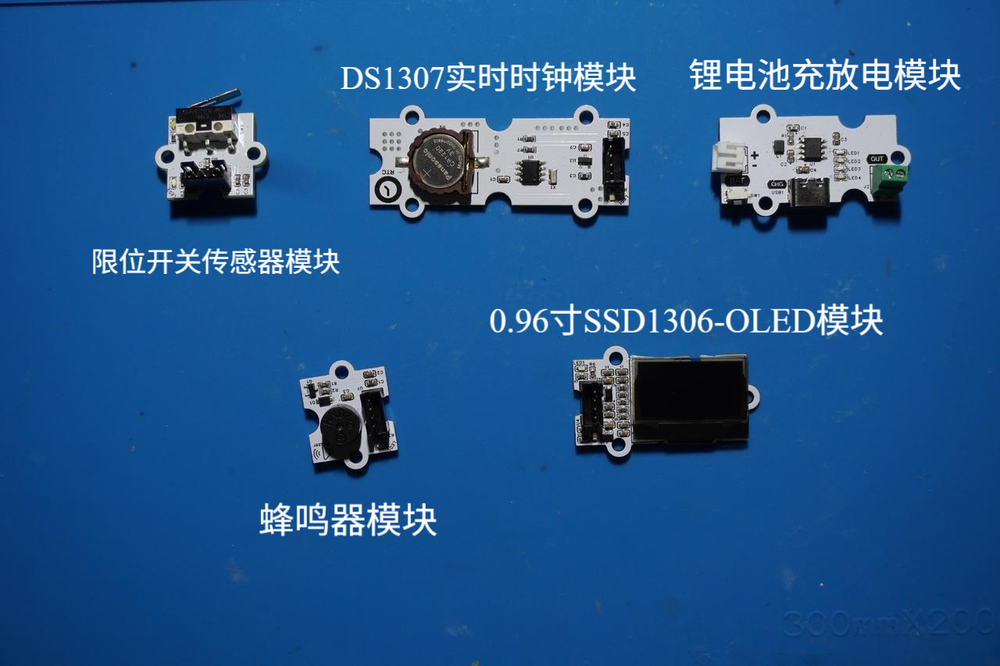
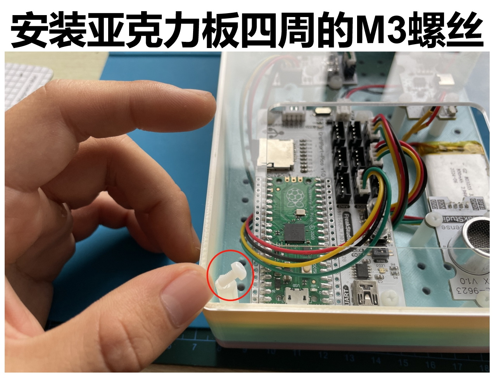
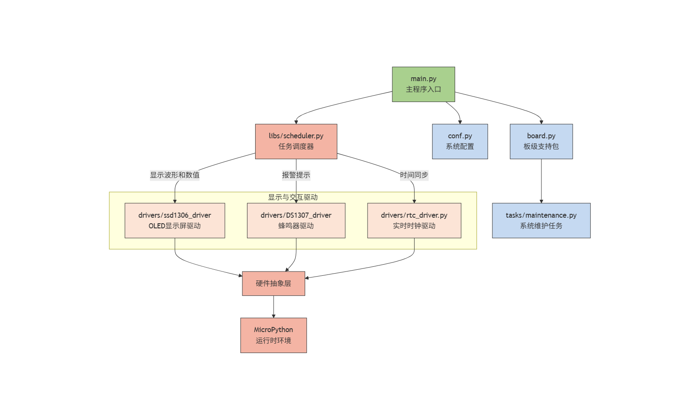
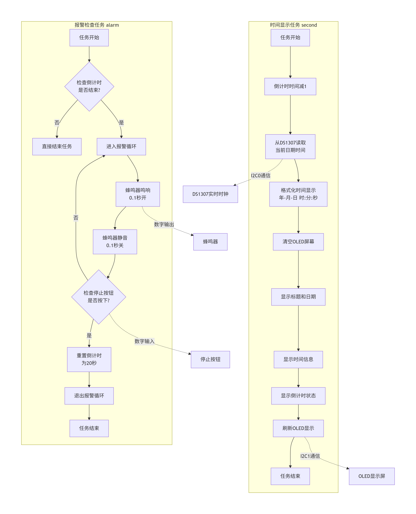
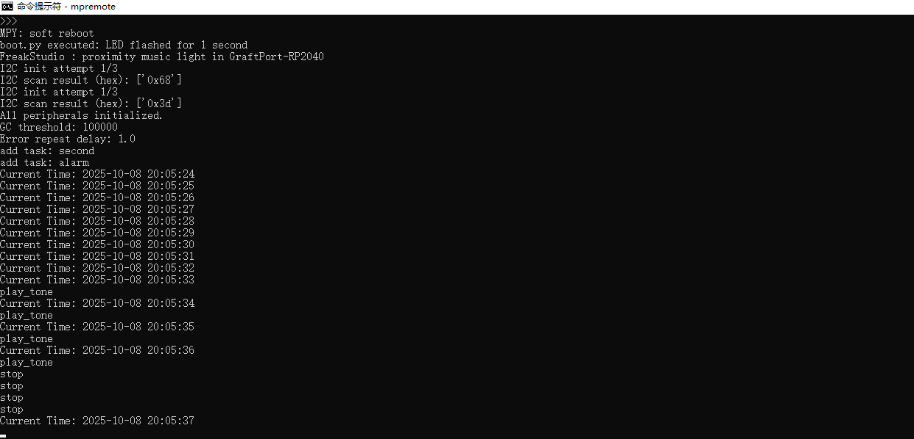

# 基于 RTC 芯片的智能闹钟装置（基于 GraftPort-RP2040 开发板）


# 目录
- [1. 简介](#1简介)
- [2. 主要功能](#2主要功能)
- [3. 硬件要求](#3硬件要求)
- [4. 软件环境](#4软件环境)
- [5. 文件结构](#5文件结构)
- [6. 关键文件说明](#6关键文件说明)
- [7. 软件设计核心思想](#7软件设计核心思想)
- [8. 使用说明](#8使用说明)
- [9. 示例程序](#9示例程序)
- [10. 注意事项](#10注意事项)
- [11. 版本记录](#11版本记录)
- [12. 联系开发者](#12联系开发者)
- [13. 许可协议](#13许可协议)
## 1.简介

### **1.1 项目背景**

传统计时设备功能单一，缺乏灵活的定时提醒和可视化交互能力。本项目**基于 GraftPort-RP2040 开发板**，结合**基于 DS1307 芯片的 RTC 实时时钟模块**、**0.96 寸 SSD1306-OLED 模块**和**无源蜂鸣器模块**，实现"时间显示-倒计时-声音提醒"一体化系统，解决传统计时设备交互性差的问题，同时融入 `MicroPython` 的轻量化任务调度与异常处理机制，保证系统稳定运行。

### **1.2 项目主要功能概览**

本项目基于 `MicroPython` 开发，核心功能是通过 **DS1307 芯片的 RTC 实时时钟模块**获取准确时间，通过 `OLED` 显示屏实时显示当前时间和倒计时，当倒计时结束时通过蜂鸣器发出报警声音，支持按键中断停止报警；内置自动垃圾回收（`GC`）避免内存泄漏，异常捕获与限速打印便于问题定位。

### **1.3 适用场景或应用领域**

- **日常计时**：作为桌面时钟，提供时间显示和定时提醒功能；
- **学习工作**：设置学习或工作时段倒计时，提高时间管理效率；
- **教学演示**：用于 `MicroPython` 任务调度、`I2C` 通信、中断处理等知识点的实践教学；
- **智能提醒**：集成到各种需要定时提醒的设备和场景中。

## 2.主要功能

- **实时时间显示**：通过**基于 DS1307 芯片的 RTC 实时时钟模块**获取准确时间，在 `OLED` 屏幕上显示年月日时分秒；
- **倒计时功能**：支持从设定时间开始倒计时，并在 `OLED` 上显示剩余时间；
- **声音报警**：倒计时结束时通过蜂鸣器发出报警声音，直到用户按下停止按钮；
- **按键中断交互**：板载按键触发下降沿中断，可切换核心任务"运行/暂停"；
- **自动内存管理**：空闲时检测内存，若低于阈值自动触发 `GC`，防止 `MicroPython` 因内存泄漏崩溃；
- **异常容错机制**：任务执行抛异常时，完整打印回溯信息并限速，避免刷屏；
- **板级适配灵活**：基于 `board.py` 实现引脚映射解耦，支持后续扩展其他 `RP2040` 开发板。

## 3.硬件要求

### 3.1 需要硬件

项目**基于 GraftPort-RP2040 开发板**作为主控：


**其余需要的模块包括：**



- **基于 DS1307 芯片的 RTC 实时时钟模块:**（`I2C` 通信，地址 `0x68`）；
- **0.96 寸 SSD1306-OLED 模块:**（`I2C` 通信，地址 `0x3c` 或 `0x3d`）；
- **无源蜂鸣器模块:**（数字输出，连接 `DIO` 引脚）；
- **限位开关传感器模块:**（数字输入，连接 `DIO` 引脚）；
- **板载按键：** 默认使用开发板固定引脚（引脚 18，上拉输入），用于任务启停控制；
- **板载 LED：** 默认使用开发板固定引脚（引脚 25），用于状态指示。

### 3.2 **硬件连线**

**DS1307 实时时钟模块**：通过 `PH2.0` 连接线接入 `I2C0` 接口；


**0.96 寸 SSD1306-OLED 模块**：通过 `PH2.0` 连接线接入 `I2C1` 接口；


**蜂鸣器模块**：通过 `PH2.0` 连接线接入 `DIO1` 接口；


**限位开关传感器模块**：通过 `PH2.0` 连接线接入 `DIO0` 接口


**锂电池充放电模块**：`BAT` 接口连接锂电池，`OUT` 接口通过 ` PH2.0-2P` 连接线为主控板供电。


### 3.3 结构装配

**首先，使用 M3 塑料柱将各模块与主控板固定在外壳底板上（主控板与外壳均预留 M3 螺丝孔）：**


**接着，利用 M3 塑料柱将外壳四周固定好，并在对应位置拧上 M3 螺丝完成装配：**



### 3.4 注意事项

**在主控板不连接外部看门狗模块时，RUN 拨码开关 2 要导通：**


**锂电池充放电模块支持电量显示，使用下面****Type-C****接口即可充电：**


## 4.软件环境

- **核心固件**：`MicroPython v1.23.0`（需适配 `GraftPort-RP2040`，支持 `machine.Pin/I2C/Timer` 模块、软定时器调度）；
- **开发 IDE**：`PyCharm`（用于代码编写、上传、调试，支持 `MicroPython REPL` 交互，需要安装 `MicroPython` 插件）；
- **辅助工具**：

  - `Python 3.12+`（用于运行本地辅助脚本，如固件烧录脚本，可选）；
  - `mpy-cross v1.23.0`（用于将 `.py` 文件编译为 `.mpy`，减少开发板内存占用，可选）；
  - `mpremote v0.11.0+`（替代 `Thonny` 上传文件，支持命令行操作，可选）；
- **依赖模块**：无额外第三方库，所有驱动（`passive_buzzer_driver.py` 等）均为自定义实现的，随项目文件提供。

## 5.文件结构

```
countdown_alarm
├─ LICENSE
├─ tools
│  ├─ dependency_analyzer.py
│  ├─ mpy_compiler.py
│  ├─ mpy_uploader.py
│  └─ README.md
├─ firmware
│  ├─ board.py
│  ├─ boot.py
│  ├─ conf.py
│  ├─ main.py
│  ├─ tasks
│  │  ├─ maintenance.py
│  │  ├─ time_task.py
│  │  └─ __init__.py
│  ├─ libs
│  │  ├─ __init__.py
│  │  └─ scheduler
│  │     ├─ scheduler.py
│  │     └─ __init__.py
│  └─ drivers
│     ├─ __init__.py
│     ├─ ssd1306_driver
│     ├─ passive_buzzer_driver
│     └─ DS1307_driver
├─ examples
│  └─ README.md
└─ docs
```

## 6.关键文件说明

- **main.py**：**项目入口，核心逻辑包括**：

  1. 上电延时 3 秒（等待硬件稳定），初始化板载 `LED`、`OLED`、实时时钟、停止按钮、蜂鸣器、按键（含中断注册）；
  2. 硬件初始化：`OLED`、`DS1307` 实时时钟、蜂鸣器、停止按钮；
  3. 创建 `TimeTask` 实例（传入硬件驱动与配置参数），封装为调度器任务（周期 1 秒和 5 秒）；
  4. 初始化 `Scheduler`（软定时器，调度周期 50ms），添加任务并启动调度，进入无限循环；
  5. 定义 `button_handler` 中断回调（切换任务启停）、`fatal_hang` 阻塞函数（严重错误处理）。
- **tasks/time_task.py**：**核心业务任务，****TimeTask****类关键逻辑：**

  1. **__init__**：初始化硬件实例和倒计时时间；
  2. **second**：每秒执行一次，读取实时时钟并更新 `OLED` 显示；
  3. **alarm**：每 5 秒执行一次，检查倒计时状态，触发报警。
- **tasks/maintenance.py**：**系统维护模块，关键函数**：

  1. `task_idle_callback`：调度器空闲时触发，检测内存低于 `GC_THRESHOLD_BYTES`（默认 100000 字节）则执行 `gc.collect()`；
  2. `task_err_callback`：任务抛异常时触发，打印完整回溯信息（优先 `sys.print_exception`），并延时 `ERROR_REPEAT_DELAY_S`（默认 1 秒）防止刷屏；
  3. 支持从 `conf.py` 读取配置，无配置时使用默认值，保证兼容性。
- **drivers/xxx_driver**：**硬件驱动模块，均采用"实例化 + 方法调用"模式**：

  - `ds1307_driver`：`DS1307` 类通过 `I2C` 通信，提供 `datetime` 属性获取当前时间；
  - `ssd1306_driver`：`SSD1306_I2C` 类通过 `I2C` 控制 `OLED` 显示，提供 `fill`、`text`、`show` 等方法；
- `board.py`：板级引脚映射模块，定义 `BOARDS` 字典（含 `GraftPort-RP2040` 的固定引脚、`I2C`/`DIO` 接口映射），提供 `get_fixed_pin`、`get_i2c_pins` 等接口，实现"板级配置与业务逻辑解耦"。
- `conf.py`：**用户配置文件，需用户手动定义的参数包括**：`I2C_INIT_MAX_ATTEMPTS`（传感器初始化重试次数）、`I2C_INIT_RETRY_DELAY_S`（重试间隔秒数）、`ENABLE_DEBUG`（调试打印开关）、`AUTO_START`（任务是否自动启动），无定义时系统使用默认值。

## 7.软件设计核心思想



- **系统分层思路：** 采用"四层架构"，实现解耦与复用
  **硬件驱动层（****drivers/****）**：仅负责硬件的底层控制，不包含业务逻辑，如 `DS1307` 实时时钟驱动只关心"如何通过 `I2C` 读取时间数据"，不关心"何时显示"；`SSD1306 OLED` 驱动只关心"如何在屏幕上绘制文字和图形"，不关心"显示什么内容"；蜂鸣器驱动只关心"如何控制 GPIO 输出 `PWM` 信号"，不关心"何时报警"；停止按钮驱动只关心"如何检测 `GPIO` 输入状态"，不关心"按下后的业务逻辑"。

  - **任务逻辑层（****tasks/****）**：基于驱动层提供的接口实现业务逻辑，如 `TimeTask` 只调用 `ds1307.datetime` 属性获取时间数据，不关心实时时钟的 I2C 地址；只调用 `ssd1306.text()` 和 `show()` 显示内容，不关心 `OLED` 的显存管理；只调用 `buzzer.value()` 控制报警声音，不关心蜂鸣器的驱动电路；只调用 `stop.value()` 检测停止信号，不关心按钮的去抖算法。
  - **调度控制层（****libs/scheduler.py****）**：提供通用的任务管理能力；
  - **入口层（****main.py****）**：负责"组装"各层，初始化硬件 → 创建任务 → 启动调度。
- **模块划分原则**：高内聚、低耦合，便于维护与扩展

  - **高内聚**：每个模块只负责单一职责；
  - **低耦合**：模块间通过"接口"交互，而非直接操作内部变量；
  - **扩展性**：新增硬件时只需在对应层添加代码，无需修改现有逻辑。
- **核心机制**：保障系统稳定与用户体验

  - **任务调度机制**：基于软定时器实现多任务协调运行；
  - **实时更新机制**：时间信息每秒更新，确保显示准确性；
  - **交互反馈机制**：按键中断即时响应，报警状态清晰明确；
  - **容错机制**：关键操作均用 `try-except` 包裹，避免单点故障。
- **任务执行流程**：**任务执行流程如下所示**:



## 8.使用说明

### **8.1 硬件连接**

按“硬件要求”中的连接方式，连接主控板、各个传感器模块和电池；

### **8.2 运行项目（使用 `PyCharm + MicroPython` 插件）**

打开 `PyCharm` 并安装对应的 `MicroPython` 插件。


在插件中选择 **运行设备（**`Target Device`**）** 为 `RP2040`，并启用 **自动检测设备路径（**`Auto-detect device path`**）**。


将`Project/firmware` 设置为项目根目录。


**修改运行配置**：


- 勾选 **允许多个实例（**`Allow multiple instances`**）**
- 选择 **存储为项目文件（**`Store as project file`**）**
- 点击 **确定** 保存配置。

点击 `IDE` 右上角的绿色三角按钮运行，即可开始上传固件并执行项目。


### **8.3 运行配置的修改**

**您可以配置** `conf.py`，**根据需求修改或添加参数，例如**：

```python
# conf.py 示例配置
I2C_INIT_MAX_ATTEMPTS = 3      # 传感器初始化最多重试次数
I2C_INIT_RETRY_DELAY_S = 0.5   # 每次重试间隔（秒）
ENABLE_DEBUG = True            # 是否开启调试打印
AUTO_START = True              # 是否在启动时自动运行任务
```

### **8.4 功能测试**

- **时间显示**：观察 `OLED` 是否正确显示当前时间；
- **倒计时功能**：验证倒计时是否正常进行并显示；
- **报警功能**：等待倒计时结束，检查蜂鸣器是否报警，按下停止按钮是否停止报警；
- **按键切换**：按下板载按键，任务暂停（停止时间更新），再次按下恢复。

在 `conf.py` 中配置不变同时硬件连接没有问题的情况下，程序可以正常运行


**终端输出结果如下所示**：



### **8.5 调试与问题定位**

- 若功能异常，确保 `ENABLE_DEBUG = True`，在终端查看调试信息；
- 若时间显示异常，检查 `DS1307` 模块连接和电池供电；
- 若 `OLED` 不显示，检查 `I2C` 地址是否正确（`0x3c` 或 `0x3d`），以及 `I2C` 总线是否正常；
- 若报警不工作，检查蜂鸣器和停止按钮的连接状态。

## 9.示例程序

本项目没有其余参考示例代码，直接在 `firmware` 文件夹中进行修改即可。

## 10.注意事项

- **传感器相关：**

  - `DS1307` 模块需要电池备份，确保断电后时间不丢失；
  - 首次使用时需要设置正确的时间。
- **硬件连接相关**：

  - 注意 `I2C` 设备的地址设置，避免地址冲突；
  - 蜂鸣器注意极性连接。
- **软件版本相关**：

  - 必须使用 `MicroPython v1.23.0` 及以上版本；
  - 调试打印会占用一定内存，正式使用时建议关闭。
- **功能使用相关**：

  - 任务周期根据实际需求调整，过小的周期可能增加系统负载；
  - 报警音量可根据实际环境调整蜂鸣器驱动电压。

## 11.版本记录

- **v1.0.0 (2025-11-03)：完成初始版本，基本功能实现和文档编写：**
  - 支持实时时间显示
  - 支持倒计时功能
  - 实现声音报警和停止功能

## 12.联系开发者

**如有任何问题或需要帮助，请通过以下方式联系开发者**：
📧 **邮箱**：<u>10696531183@qq.com</u>
💻 **GitHub**：<u>[https://github.com/FreakStudioCN](https://github.com/FreakStudioCN)</u>

## 13.许可协议

本项目中，除 `machine` 等 `MicroPython` 官方模块（`MIT` 许可证）外，所有由作者编写的驱动与扩展代码均采用 **知识共享署名-非商业性使用 4.0 国际版 (CC BY-NC 4.0)** 许可协议发布。

**您可以自由地**：

- **共享** — 在任何媒介以任何形式复制、发行本作品
- **演绎** — 修改、转换或以本作品为基础进行创作

**惟须遵守下列条件**：

- **署名** — 您必须给出适当的署名，提供指向本许可协议的链接，同时标明是否（对原始作品）作了修改。您可以用任何合理的方式来署名，但是不得以任何方式暗示许可人为您或您的使用背书。
- **非商业性使用** — 您不得将本作品用于商业目的。
- **合理引用方式** — 可在代码注释、文档、演示视频或项目说明中明确来源。

**版权归 FreakStudio 所有。**

# 附件一：项目源代码下载

# 附件二：硬件模块参考资料

[GraftSense-无源蜂鸣器模块(开放版)](https://f1829ryac0m.feishu.cn/docx/HhiZd9es9ocGrxxA27ycxDXknmc?from=from_copylink)

[GraftPort-RP2040 开发板](https://f1829ryac0m.feishu.cn/docx/ZHdjdPdCwonbLyxVeAdcehG4n8b?from=from_copylink)

**0.96 寸 SSD1306-OLED 模块**

# 版本记录

<table>
<tr>
<td>文档版本<br/></td><td>修改日期<br/></td><td>修改人<br/></td><td>修改内容<br/></td></tr>
<tr>
<td>V1.0.0<br/></td><td>2025-11-06<br/></td><td>侯钧瀚<br/></td><td>编写文档初稿。<br/></td></tr>
<tr>
<td><br/></td><td><br/></td><td><br/></td><td><br/></td></tr>
</table>
