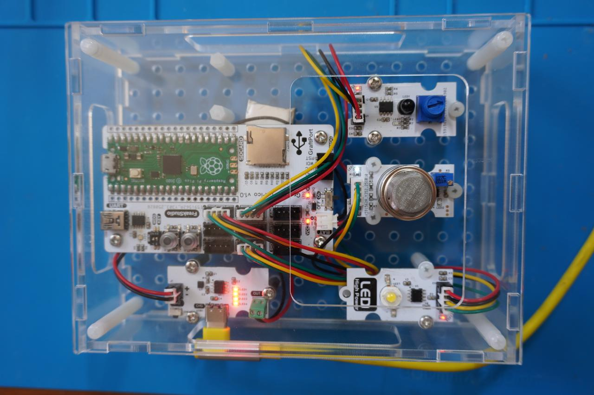
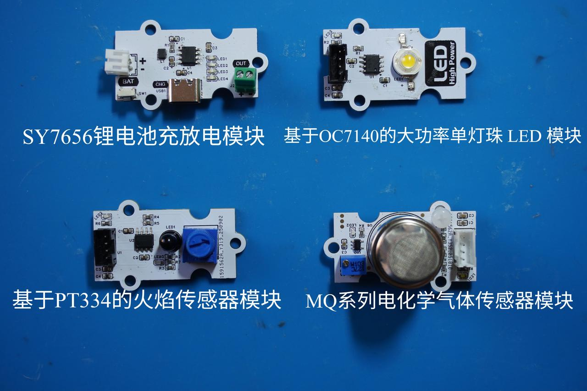
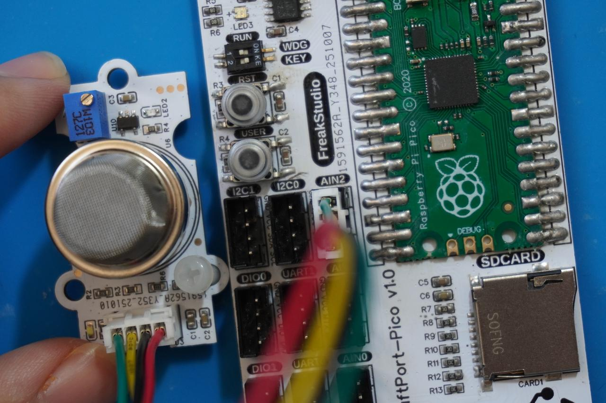

# 多传感器协同式火灾报警装置（基于 GraftPort-RP2040 开发板）




# 目录
- [1. 简介](#1简介)
- [2. 主要功能](#2主要功能)
- [3. 硬件要求](#3硬件要求)
- [4. 软件环境](#4软件环境)
- [5. 文件结构](#5文件结构)
- [6. 关键文件说明](#6关键文件说明)
- [7. 软件设计核心思想](#7软件设计核心思想)
- [8. 使用说明](#8使用说明)
- [9. 示例程序](#9示例程序)
- [10. 注意事项](#10注意事项)
- [11. 版本记录](#11版本记录)
- [12. 联系开发者](#12联系开发者)
- [13. 许可协议](#13许可协议)
# 项目说明

## 1.简介

### **1.1 项目背景**

传统安防报警系统多为单一功能或固定阈值检测，缺乏智能化的多传感器融合检测能力。本项目**基于 GraftPort-RP2040 开发板**，结合 **MQ 系列电化学气体传感器模块**、**基于 PT334 的火焰传感器模块和 LED 报警灯**，实现"烟雾-火焰双重检测-智能报警"一体化系统，解决传统安防系统检测单一的问题，同时融入 `MicroPython` 的轻量化任务调度与异常处理机制，保证系统稳定运行。

### **1.2 项目主要功能概览**

本项目基于 `MicroPython` 开发，核心功能是通过 **MQ 系列电化学气体传感器模块**和**基于 PT334 的火焰传感器模块**实时检测环境状态，当任一传感器检测到异常时触发 `LED` 报警；系统每 5 秒检查一次传感器状态，如果两个传感器都恢复正常则自动关闭报警，实现智能化报警管理。

### **1.3 适用场景或应用领域**

- **家庭安防：** 实时监测厨房、卧室等区域的烟雾和火焰情况，预防火灾；
- **工业安全：** 用于工厂、仓库等场所的火灾预警和安全监控；
- **教学演示：** 用于 `MicroPython` 任务调度、数字输入检测、`PWM` 控制等知识点的实践教学；
- **智能家居：** 集成到智能家居系统中，提供火灾预警功能。

## 2.主要功能

- **双重安全检测：** 通过** MQ 系列电化学气体传感器模块**检测烟雾，**基于 PT334 的火焰传感器模块**检测火焰，实现双重安全保障；
- **智能报警管理：** 每 5 秒自动检查传感器状态，异常时立即报警，恢复正常时自动关闭；
- **实时状态监控：** 每 200 毫秒读取一次传感器数据，确保检测的实时性；
- **可视化报警指示：** 通过 `LED` 灯提供清晰的报警状态指示；
- **自动状态恢复：** 当环境恢复正常时，系统自动关闭报警，无需手动干预；
- **调试支持：** 支持调试信息输出，便于开发和故障排查。

## 3.硬件要求

### 3.1 需要硬件

项目**基于 GraftPort-RP2040 开发板**作为主控：


**其余需要的模块包括：**



- **GtaftSense-MQ 系列电化学气体传感器模块:**（数字输出，低电平表示检测到烟雾）；
- **GtaftSense-基于 PT334 的火焰传感器模块:**（数字输出，低电平表示检测到火焰）；
- **GtaftSense-基于 OC7140 的大功率单灯珠 LED 模块：**（`PWM` 控制，支持亮度调节）；
- **GtaftSense-基于 SY7656 锂电池充放电模块:（连接聚合物锂电池，输出 5V 电压，带****Type-C****充电接口）；**
- **板载按键：** 默认使用开发板固定引脚（引脚 18，上拉输入），无需额外接线。
- **板载`LED`：** 默认使用开发板固定引脚（引脚 25），无需额外接线。

### 3.2 **硬件连线**

**MQ 系列电化学气体传感器模块**：数字输出引脚连接到开发板的 `AIN2` 输入引脚；



**基于 PT334 的火焰传感器模块**：数字输出引脚连接到开发板的 `AIN1` 输入引脚；


**基于 OC7140 的大功率单灯珠 LED 模块**：连接到开发板的 `DIO0` 输出引脚。


**锂电池充放电模块**：`BAT` 接口连接锂电池，`OUT` 接口通过 `PH2.0-2P` 连接线为主控板供电。


### 3.3 结构装配

**首先，使用 M3 塑料柱将各模块与主控板固定在外壳底板上（主控板与外壳均预留 M3 螺丝孔）**：


**接着，利用 M3 塑料柱将外壳四周固定好，并在对应位置拧上 M3 螺丝完成装配：**


### 3.4 注意事项

**在主控板不连接外部看门狗模块时，RUN 拨码开关 2 要导通**：


**锂电池充放电模块支持电量显示，使用下面`Type-C`接口即可充电：**


## 4.软件环境

- **核心固件**：`MicroPython v1.23.0`（需适配 `GraftPort-RP2040`，支持 `machine.Pin/I2C/Timer` 模块、软定时器调度）；
- **开发 IDE**：`PyCharm`（用于代码编写、上传、调试，支持 `MicroPython REPL` 交互，需要安装 `MicroPython` 插件）；
- **辅助工具**：

  - `Python 3.12+`（用于运行本地辅助脚本，如固件烧录脚本，可选）；
  - `mpy-cross v1.23.0`（用于将 `.py` 文件编译为 `.mpy`，减少开发板内存占用，可选）；
  - `mpremote v0.11.0+`（替代 `Thonny` 上传文件，支持命令行操作，可选）；
- **依赖模块**：无额外第三方库，所有驱动（`passive_buzzer_driver.py` 等）均为自定义实现的，随项目文件提供。

## 5.文件结构

```
fire_gas_alarm
├─ .flake8
├─ LICENSE
├─ README.md
├─ tools
│  ├─ dependency_analyzer.py
│  ├─ mpy_compiler.py
│  ├─ mpy_uploader.py
│  └─ README.md
├─ firmware
│  ├─ board.py
│  ├─ boot.py
│  ├─ conf.py
│  ├─ main.py
│  ├─ tasks
│  │  ├─ maintenance.py
│  │  ├─ sensor_task.py
│  │  └─ __init__.py
│  ├─ libs
│  │  ├─ __init__.py
│  │  └─ scheduler
│  └─ drivers
│     ├─ __init__.py
│     ├─ mqx_driver
│     ├─ led_single_driver
│     └─ flame_driver
├─ examples
└─ docs
```

## 6.关键文件说明

- `main.py`：**项目入口，核心逻辑包括**：

  1. 上电延时 3 秒（等待硬件稳定），初始化板载 `LED`、**基于 PT334 的火焰传感器模块**、`MQ-2` 传感器、按键（含中断注册）；
  2. 硬件初始化：**基于 PT334 的火焰传感器模块**、`MQ-2` 传感器、报警 `LED`；
  3. 创建 `sensor_task` 实例（传入硬件驱动与配置参数），封装为调度器任务（周期 200ms）；
  4. 初始化 `Scheduler`（软定时器，调度周期 10ms），添加任务并启动调度，进入无限循环；
  5. 定义 `fire_callback` 中断回调（切换任务启停）、`fatal_hang` 阻塞函数（严重错误处理）。
- `tasks/sensor_task.py`：**核心业务任务，**`GasFireAlarmTask`**类关键逻辑：**

  1. `init`：初始化硬件实例；
  2. `tick`：每 200ms 执行一次，流程为"读取传感器状态 → 判断是否报警 → 控制 `LED` 报警"；
- `tasks/maintenance.py` **：系统维护模块，关键函数：**

  1. `task_idle_callback`：调度器空闲时触发，检测内存低于 `GC_THRESHOLD_BYTES`（默认 100000 字节）则执行 `gc.collect()`；
  2. `task_err_callback`：任务抛异常时触发，打印完整回溯信息（优先 `sys.print_exception`），并延时 `ERROR_REPEAT_DELAY_S`（默认 1 秒）防止刷屏；
  3. 支持从 `conf.py` 读取配置，无配置时使用默认值，保证兼容性。
- `drivers/xxx_driver` **：硬件驱动模块，均采用"实例化 + 方法调用"模式，仅暴露与硬件相关的控制接口，屏蔽底层细节：**

  - `flame_driver`：`FlameSensor` 类通过数字引脚读取火焰状态，`is_flame_detected` 方法返回检测状态；
  - `mqx_driver`：`MQX` 类通过数字引脚读取烟雾状态，`comp_pin.value()` 获取数字输出（0 表示检测到烟雾）；
  - `led_single_driver`：`PowerLED` 类通过 `PWM` 控制 `LED` 亮度，提供 `on`、`off`、`set_brightness` 等方法。
- `board.py`：板级引脚映射模块，定义 `BOARDS` 字典（含 **GraftPort-RP2040** 的固定引脚、`I2C`/`DIO` 接口映射），提供 `get_fixed_pin`、`get_dio_pins` 等接口，实现"板级配置与业务逻辑解耦"，后续扩展其他开发板只需添加 `BOARDS` 子项。
- `conf.py`：**用户配置文件，需用户手动定义的参数包括**：`ENABLE_DEBUG`（调试打印开关）、`AUTO_START`（任务是否自动启动），无定义时系统使用默认值。

## 7.软件设计核心思想


- **系统分层思路**：采用"四层架构"，实现解耦与复用
- **硬件驱动层**（`drivers/`）：负责硬件的底层控制，如火焰传感器驱动只关心"如何获取火焰状态"；
- **任务逻辑层**（`tasks/`）：基于驱动层实现业务逻辑，如 `GasFireAlarmTask` 调用传感器状态判断报警条件；
- **调度控制层**（`libs/scheduler.py`）：提供通用的任务管理能力，支持任务添加/暂停/恢复；
- **入口层**（`main.py`）：负责"组装"各层，初始化硬件 → 创建任务 → 启动调度。
- **核心机制**：保障系统稳定与用户体验
- **任务调度机制**：基于软定时器实现，调度周期 10ms，核心任务周期 200ms，通过"计数器累加"判断任务执行时机；
- **智能报警机制**：采用"双传感器验证 + 周期性检查"策略，提高报警准确性，减少误报；
- **容错机制**：所有关键操作均用 `try-except` 包裹，避免单一模块故障导致系统崩溃。

**任务执行流程：任务执行流程如下所示：**


## 8.使用说明

### **8.1 硬件连接**

按“硬件要求”中的连接方式，连接主控板、各个传感器模块和电池；

### **8.2 运行项目（使用 ` PyCharm + MicroPython` 插件）**

打开 `PyCharm` 并安装对应的 `MicroPython` 插件。


在插件中选择 **运行设备（`Target Device`）** 为 `RP2040`，并启用 **自动检测设备路径（****Auto-detect device path****）**。


将  `Project/firmware` 设置为项目根目录。


**修改运行配置**：


- 勾选 **允许多个实例（****Allow multiple instances****）**
- 选择 **存储为项目文件（****Store as project file****）**
- 点击 **确定** 保存配置。

点击 `IDE` 右上角的绿色三角按钮运行，即可开始上传固件并执行项目。


### **8.3 运行配置的修改**

**您可以配置 `conf.py`，根据需求修改或添加参数，例如**：

```python
# conf.py 示例配置
I2C_INIT_MAX_ATTEMPTS = 3      # 传感器初始化最多重试次数
I2C_INIT_RETRY_DELAY_S = 0.5   # 每次重试间隔（秒）
ENABLE_DEBUG = True            # 是否开启调试打印
AUTO_START = True              # 是否在启动时自动运行任务
```

### **8.4 功能测试**

- **传感器校准：** 在常态环境下对火焰传感器和气体传感器进行校准

  - **火焰传感器：** 手动拧旋钮至 `LED3` 红色灯亮后，略微回拧旋钮至红色 `LED3` 灯正好在常态环境下熄灭即可
  - **气体传感器:** 螺丝刀拧可变电阻至 `LED2` 红色灯亮后，略微回拧旋钮至红色 `LED2` 灯正好在常态环境下熄灭即可
- **火焰检测**：使用打火机在安全距离测试火焰传感器，观察 `LED` 是否报警；


- **气体检测**：使用酒精棉等测试 `MQ-2` 传感器，观察 `LED` 是否报警；
- **自动恢复**：移除火源和气体源，观察 5 秒后 `LED` 是否自动关闭。


**终端输出结果如下所示**：


### **8.5 调试与问题定位**

- 若功能异常，确保 `ENABLE_DEBUG = True`，在终端查看调试信息；
- 若传感器初始化失败，检查硬件连接、电源、引脚配置；
- 若 `LED` 不亮，检查 `PWM` 配置和驱动电路。

## 9.示例程序

本项目没有其余参考示例代码，直接在 `firmware` 文件夹中进行修改即可。

## 10.注意事项

- **传感器相关**：

  - 火焰传感器需要避免强光直射，以免影响检测精度；
  - `MQ-2` 传感器需要预热时间，刚上电时读数可能不稳定。
- **硬件连接相关**：

  - 注意传感器的工作电压和信号电平，确保与主控板兼容；
  - `LED` 模块需要合适的限流电阻，避免过流损坏。
- **软件版本相关**：

  - 必须使用 `MicroPython v1.23.0` 及以上版本；
  - 调试打印会占用一定内存，正式使用时建议关闭。
- **功能使用相关**：

  - 任务周期（200ms）不建议修改过小，否则可能增加系统负载；
  - 报警逻辑可根据实际需求调整传感器判断条件。

## 11.版本记录

- **v1.0.0 (2025-11-03)：侯钧瀚完成初始版本，基本功能实现和文档编写**：
  - 支持火焰传感器检测
  - 支持 `MQ-2` 气体传感器检测
  - 实现 `LED` 报警控制
  - 实现智能报警逻辑

## 12.联系开发者

**如有任何问题或需要帮助，请通过以下方式联系开发者**：

📧 **邮箱**：<u>10696531183@qq.com</u>
💻 **GitHub**：<u>[https://github.com/FreakStudioCN](https://github.com/FreakStudioCN)</u>

## 13.许可协议

本项目中，除 `machine` 等 `MicroPython` 官方模块（`MIT ` 许可证）外，所有由作者编写的驱动与扩展代码均采用 **知识共享署名-非商业性使用 4.0 国际版 (CC BY-NC 4.0)** 许可协议发布。

**您可以自由地**：

- **共享** — 在任何媒介以任何形式复制、发行本作品
- **演绎** — 修改、转换或以本作品为基础进行创作

**惟须遵守下列条件**：

- **署名** — 您必须给出适当的署名，提供指向本许可协议的链接，同时标明是否（对原始作品）作了修改。您可以用任何合理的方式来署名，但是不得以任何方式暗示许可人为您或您的使用背书。
- **非商业性使用** — 您不得将本作品用于商业目的。
- **合理引用方式** — 可在代码注释、文档、演示视频或项目说明中明确来源。

**版权归 FreakStudio 所有。**

# 附件一：项目源代码下载

# 附件二：硬件模块参考资料

[GraftPort-RP2040 开发板](https://f1829ryac0m.feishu.cn/docx/ZHdjdPdCwonbLyxVeAdcehG4n8b?from=from_copylink)

# 版本记录

<table>
<tr>
<td>文档版本<br/></td><td>修改日期<br/></td><td>修改人<br/></td><td>修改内容<br/></td></tr>
<tr>
<td>V1.0.0<br/></td><td>2025-11-03<br/></td><td>侯钧瀚<br/></td><td>编写文档初稿。<br/></td></tr>
<tr>
<td><br/></td><td><br/></td><td><br/></td><td><br/></td></tr>
</table>
