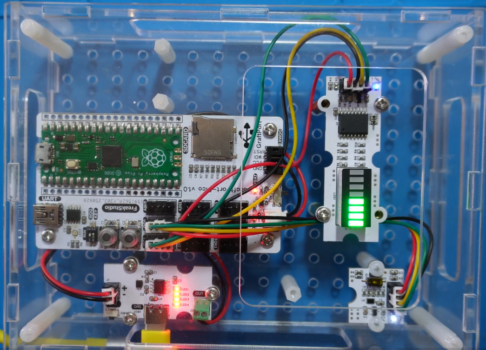
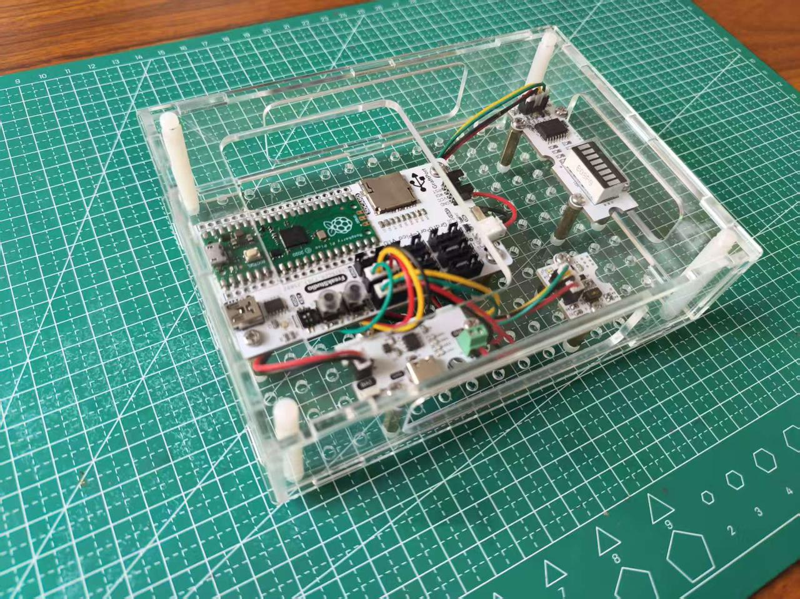
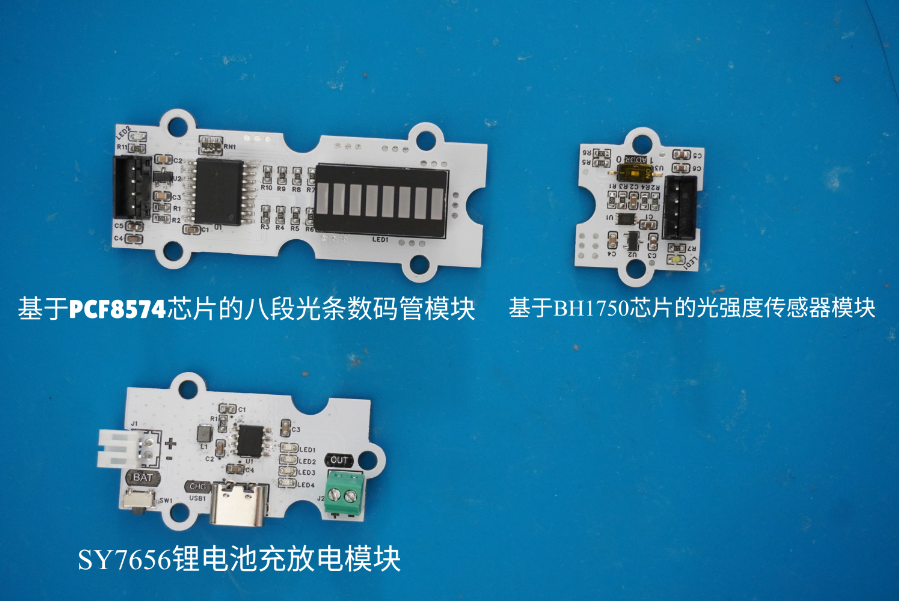
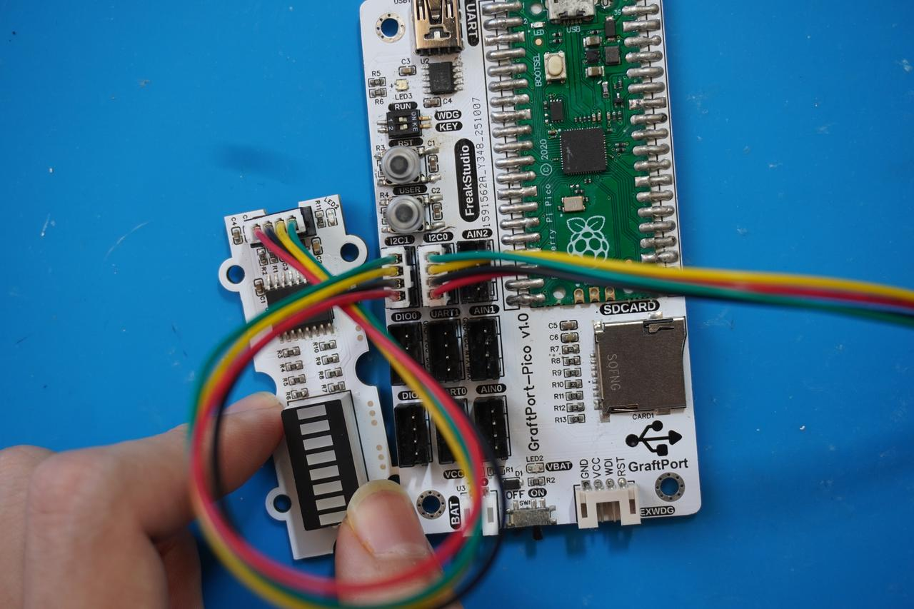
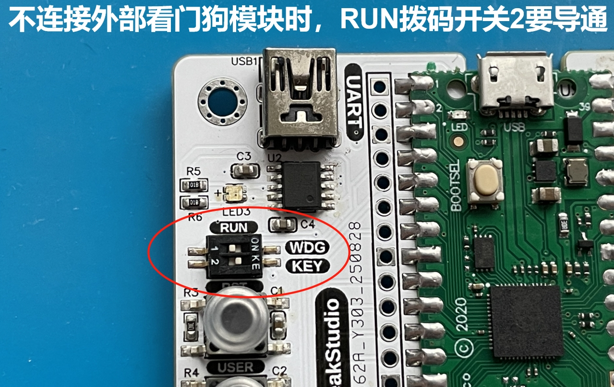
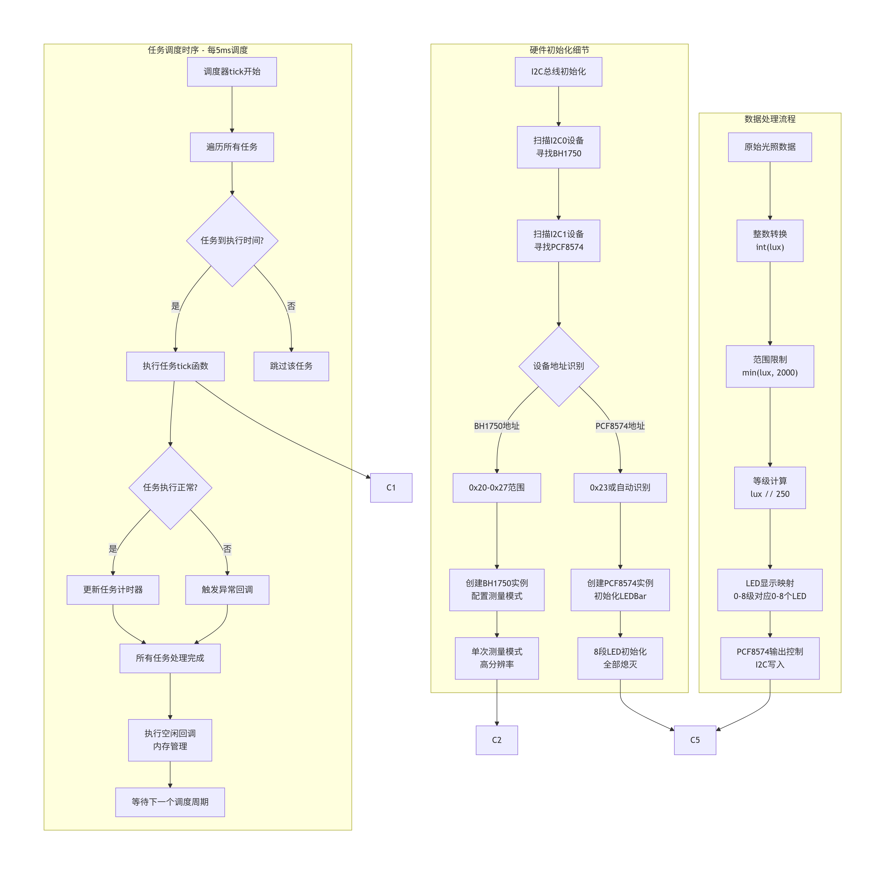
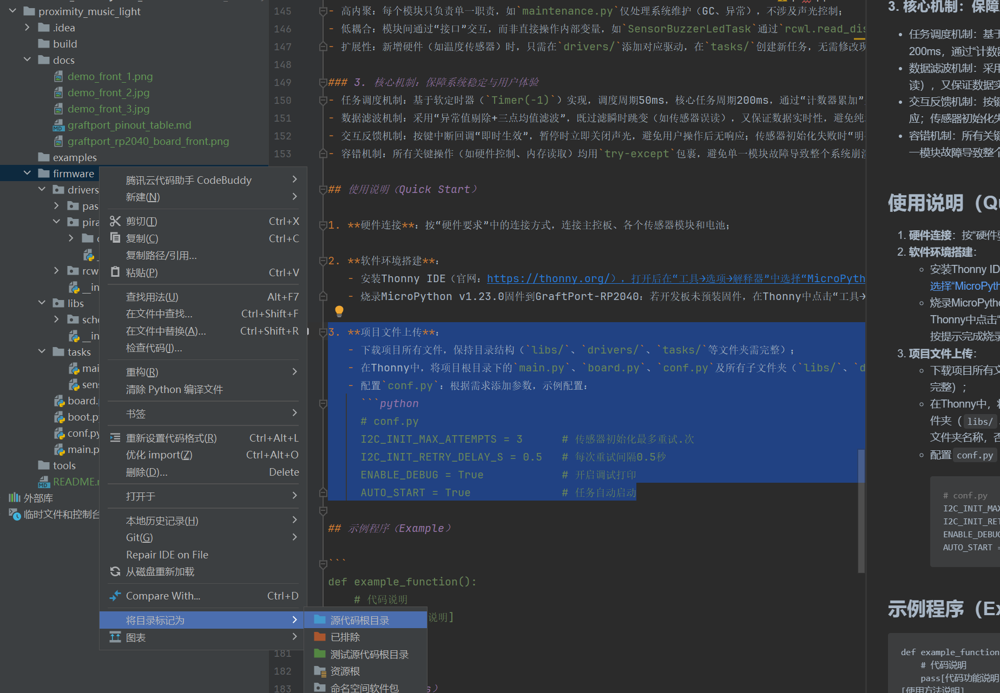

# 光强参数可视化监测装置 （基于 GraftPort-RP2040 开发板）






# 目录
- [1. 简介](#1简介)
- [2. 主要功能](#2主要功能)
- [3. 硬件要求](#3硬件要求)
- [4. 软件环境](#4软件环境)
- [5. 文件结构](#5文件结构)
- [6. 关键文件说明](#6关键文件说明)
- [7. 软件设计核心思想](#7软件设计核心思想)
- [8. 使用说明](#8使用说明)
- [9. 示例程序](#9示例程序)
- [10. 注意事项](#10注意事项)
- [11. 版本记录](#11版本记录)
- [12. 联系开发者](#12联系开发者)
- [13. 许可协议](#13许可协议)
- 
# 项目说明

## 1.简介

### **1.1 项目背景**

传统的光照检测设备通常功能单一，缺乏直观的光照强度可视化显示。本项目**基于 GraftPort-RP2040 开发板**，结合**基于 BH1750 芯片的光强度传感器模块**和**基于 PCF8574 芯片的八段光条数码管模块**，实现"光照强度检测-可视化显示"一体化系统，通过 `LED` 条形图直观展示当前光照强度，同时融入 `MicroPython` 的轻量化任务调度与异常处理机制，保证系统稳定运行。

### **1.2 项目主要功能概览**

本项目基于 `MicroPython` 开发，核心功能是通过**基于 BH1750 芯片的光强度传感器模块**实时检测环境光照强度（单位：`lux`），**基于 PCF8574 芯片的八段光条数码管模块**以条形图形式直观显示光照强度等级；支持板载按键中断切换任务启停，内置自动垃圾回收（`GC`）避免内存泄漏，异常捕获与限速打印便于问题定位。

### **1.3 适用场景或应用领域**

- **智能照明控制**：根据环境光照强度自动调节 `LED` 显示，用于智能家居照明系统；
- **环境监测**：作为便携式光照强度监测设备，用于农业温室、室内光照调节；
- **教学演示**：用于 `MicroPython` 任务调度、`I2C` 通信、传感器数据采集等知识点的实践教学；
- **艺术装置**：集成到互动艺术装置中，根据环境光照变化产生视觉反馈。

## 2.主要功能

- **实时光照强度检测**：通过**基于 BH1750 芯片的光强度传感器模块**实时采集环境光照强度，测量范围 `0-65535 lux`；
- **LED 条形图显示**：**基于 PCF8574 芯片的八段光条数码管模块**，根据光照强度动态显示相应等级；
- **自适应量程**：光照强度自动映射到 `0-8` 个 `LED` 等级（`0-2000 lux范围`），超出范围自动限幅；
- **按键中断交互**：板载按键触发下降沿中断，可切换核心任务"运行/暂停"，暂停时停止数据采集和显示更新；
- **自动内存管理**：空闲时检测内存，若低于阈值自动触发 `GC`，防止 `MicroPython` 因内存泄漏崩溃；
- **异常容错机制**：任务执行抛异常时，完整打印回溯信息并限速，避免刷屏；
- **板级适配灵活**：基于 `board.py` 实现引脚映射解耦，支持后续扩展其他 `RP2040` 开发板。

## 3.硬件要求

### 3.1 需要硬件

项目**基于 GraftPort-RP2040 开发板**作为主控：


**其余需要的模块包括：**



- **GtaftSense-基于 BH1750 芯片的光强度传感器模块**（`I2C` 通信，默认地址 `0x23`）；
- **GtaftSense-基于 PCF8574 芯片的八段光条数码管模块**（通过 `PCF8574` 模块控制 8 段 `LED` 条形显示器，默认地址 `0x20`）；
- **GtaftSense-基于 SY7656 锂电池充放电模块:（连接聚合物锂电池，输出 5V 电压，带**`Type-C`**充电接口）；**
- **板载按键**：默认使用开发板固定引脚（引脚 18，上拉输入），无需额外接线；
- **板载 LED**：默认使用开发板固定引脚（引脚 25），无需额外接线。

### 3.2 **硬件连线**

**基于 BH1750 芯片的光强度传感器模块**：通过 `PH2.0` 连接线接入 `I2C0` 接口；


**八段光条数码管模块**：通过 `PH2.0` 连接线接入 `I2C1` 接口



**锂电池充放电模块**：`BAT` 接口连接锂电池，`OUT` 接口通过 ` PH2.0-2P` 连接线为主控板供电。


### 3.3 结构装配

**首先，使用 M3 塑料柱将各模块与主控板固定在外壳底板上（主控板与外壳均预留 M3 螺丝孔）**：


**接着，利用 M3 塑料柱将外壳四周固定好，并在对应位置拧上 M3 螺丝完成装配**：


### 3.4 注意事项

**在主控板不连接外部看门狗模块时，RUN 拨码开关 2 要导通**：



**锂电池充放电模块支持电量显示，使用下面 Type-C 接口即可充电**：


- `BH1750` 默认 `I2C` 地址为 `0x23`，系统启动时自动扫描并识别；
- `PCF8574` 默认 `I2C` 地址为 `0x20`，支持地址范围 `0x20-0x27`，系统自动检测。

## 4.软件环境

- **核心固件**：`MicroPython v1.23.0`（需适配 `GraftPort-RP2040`，支持 `machine.Pin/I2C/Timer` 模块）；
- **开发 IDE：**`PyCharm`（用于代码编写、上传、调试，支持 `MicroPython REPL` 交互）；
- **辅助工具**：

  - `Python 3.12+`（用于运行本地辅助脚本，可选）；
  - `mpy-cross v1.23.0`（用于将 `.py` 文件编译为 `.mpy`，减少开发板内存占用，可选）；
  - `mpremote v0.11.0+`（替代 `Thonny` 上传文件，支持命令行操作，可选）；
- **依赖模块**：无额外第三方库，所有驱动均为自定义实现，随项目文件提供。

## 5.文件结构

```
light_intensity_display
├─ .flake8
├─ LICENSE
├─ README.md
├─ tools
│  ├─ dependency_analyzer.py
│  ├─ mpy_compiler.py
│  ├─ mpy_uploader.py
│  └─ README.md
├─ firmware
│  ├─ board.py
│  ├─ boot.py
│  ├─ conf.py
│  ├─ main.py
│  ├─ tasks
│  │  ├─ maintenance.py
│  │  ├─ sensor_task.py
│  │  └─ __init__.py
│  ├─ libs
│  │  ├─ __init__.py
│  │  └─ scheduler
│  └─ drivers
│     ├─ __init__.py
│     ├─ pcf8574_led_driver
│     └─ BH1750_driver
└─ examples
   └─ README.md
```

## 6.关键文件说明

- `main.py` **：项目入口，核心逻辑包括：**

  1. 上电延时 3 秒（等待硬件稳定），初始化板载 `LED`、`I2C` 总线、按键（含中断注册）；
  2. 硬件初始化：扫描 `I2C` 总线识别 `BH1750` 和 `PCF8574` 设备地址；
  3. 创建 `BH1750` 传感器和 `PCF8574 LED` 驱动实例；
  4. 创建 `sensor_task` 实例（传入硬件驱动与配置参数），封装为调度器任务（周期 10ms）；
  5. 初始化 `Scheduler`（软定时器，调度周期 5ms），添加任务并启动调度，进入无限循环；
  6. 定义 `button_handler` 中断回调（切换任务启停）、`fatal_hang` 阻塞函数（严重错误处理）。
- `tasks/sensor_task.py`**：核心业务任务，****sensorTask****类关键逻辑：**

  1. `__init__`：初始化 `BH1750` 传感器和 `LEDBar` 实例，配置传感器测量模式（单次测量、高分辨率）；
  2. `tick`：每 10ms 执行一次，流程为"读取光照强度 → 计算 `LED` 显示等级 → 更新 `LED` 条形图显示"；
  3. 光照强度映射：`0-2000 lux` 范围线性映射到 `0-8` 个 `LED` 等级，超出范围自动限幅。
- `tasks/maintenance.py` **：系统维护模块，关键函数：**

  1. `task_idle_callback`：调度器空闲时触发，检测内存低于 `GC_THRESHOLD_BYTES`（默认 100000 字节）则执行 `gc.collect()`；
  2. `task_err_callback`：任务抛异常时触发，打印完整回溯信息（优先 `sys.print_exception`），并延时 `ERROR_REPEAT_DELAY_S`（默认 1 秒）防止刷屏；
  3. 支持从 `conf.py` 读取配置，无配置时使用默认值，保证兼容性。
- `drivers/xxx_driver`**：硬件驱动模块，均采用"实例化 + 方法调用"模式：**

  - `BH1750_driver`：`BH1750` 类通过 `I2C` 通信，提供光照强度测量功能，支持单次/连续测量模式；
  - `pcf8574_led_driver`：`PCF8574` 类通过 `I2C` 控制 `IO` 扩展，`LEDBar` 类提供 8 段 `LED` 条形图显示控制。
- `board.py`：板级引脚映射模块，定义 `BOARDS` 字典（含 `GraftPort-RP2040` 的固定引脚、`I2C` 接口映射），提供 `get_fixed_pin、get_i2c_pins` 等接口，实现"板级配置与业务逻辑解耦"。
- `conf.py`：用户配置文件，需用户手动定义的参数包括：`ENABLE_DEBUG`（调试打印开关）、`AUTO_START`（任务是否自动启动），无定义时系统使用默认值。

## 7.软件设计核心思想


- **系统分层思路**：采用"四层架构"，实现解耦与复用

  - **硬件驱动层**（`drivers/`）：仅负责硬件的底层控制，如 `BH1750` 驱动只关心"如何获取光照数据"，`PCF8574` 驱动只关心"如何控制 `LED`"；
  - **任务逻辑层**（`tasks/`）：基于驱动层接口实现业务逻辑，如 `sensorTask` 调用 `BH1750` 获取光照数据，调用 `LEDBar` 控制显示，不关心具体硬件细节；
  - **调度控制层**（`libs/scheduler.py`）：提供通用的任务管理能力，支持任务添加/暂停/恢复，通过软定时器统一管理任务执行时机；
  - **入口层**（`main.py`）：负责硬件初始化、任务创建和调度启动，是系统的"胶水代码"。
- **模块划分原则**：高内聚、低耦合，便于维护与扩展

  - **高内聚**：每个模块职责单一，`maintenance.py` 仅处理系统维护，`sensor_task.py` 仅处理光照数据采集和显示逻辑；
  - **低耦合**：模块间通过接口交互，如 `sensorTask` 通过 `BH1750.measurement` 获取数据，通过 `LEDBar.display_level()` 控制显示；
  - **扩展性**：新增传感器时只需在 `drivers/` 添加对应驱动，在 `tasks/` 创建新任务，无需修改现有代码。
- **核心机制**：保障系统稳定与用户体验

  - **任务调度机制**：基于软定时器实现，调度周期 5ms，核心任务周期 10ms，通过"计数器累加"判断任务执行时间；
  - **动态显示机制**：光照强度实时映射到 `LED` 条形图，提供直观的光照强度可视化反馈；
  - **交互反馈机制**：按键中断即时响应，可随时暂停/恢复数据采集和显示更新；
  - **容错机制**：关键操作使用 `try-except` 包裹，`I2C` 设备自动扫描和地址识别，硬件故障不影响系统基本运行。
- **任务执行流程**：
  

## 8.使用说明

### **8.1 硬件连接**

按“硬件要求”中的连接方式，连接主控板、各个传感器模块和电池；

### **8.2 运行项目（使用 **`PyCharm + MicroPython ` **插件）**

打开 `PyCharm` 并安装对应的 `MicroPython` 插件。


在插件中选择 **运行设备（**`Target Device`**）** 为 `RP2040`，并启用 **自动检测设备路径（**`Auto-detect device path`**）**。


将 ` Project/firmware` 设置为项目根目录。



**修改运行配置**：


- 勾选 **允许多个实例（**`Allow multiple instances`**）**
- 选择 **存储为项目文件（**`Store as project file`**）**
- 点击 **确定** 保存配置。

点击 `IDE` 右上角的绿色三角按钮运行，即可开始上传固件并执行项目。


### **8.3 运行配置的修改**

**您可以配置 `conf.py`，根据需求修改或添加参数，例如**：

```python
# conf.py 示例配置
I2C_INIT_MAX_ATTEMPTS = 3      # 传感器初始化最多重试次数
I2C_INIT_RETRY_DELAY_S = 0.5   # 每次重试间隔（秒）
ENABLE_DEBUG = True            # 是否开启调试打印
AUTO_START = True              # 是否在启动时自动运行任务
```

### 8.4. 功能测试

- **光照检测**：用手遮挡或使用光源照射 `BH1750` 传感器，观察 `LED` 条形图显示变化；


- **按键控制**：按下板载按键，任务暂停（停止数据采集和显示更新），再次按下恢复；
- **强度映射**：观察不同光照强度下 LED 点亮数量的对应关系（`0-250 lux` 点亮 1 个 `LED`，`1750-2000 lux` 点亮 8 个 `LED`）。

### **8.5 调试与问题定位**

- 若 `I2C` 设备不响应，检查硬件连接、电源、`I2C` 地址配置；
- 若 `PCF8574` `LED` 不亮，检查 `I2C` 地址是否正确（`0x20`~`0x27`），使用 `I2C` 扫描确认设备地址；
- `若BH1750`,检查 `I2C` 地址是否正确（`0x23`），使用 `I2C` 扫描确认设备地址；

## 9.示例程序

本项目没有其余参考示例代码，直接在项目文件夹中进行修改即可。

## 10.注意事项

- **传感器相关**：

  - 基于 `BH1750` 芯片的光强度传感器模块需要适当的测量时间，单次测量模式需等待测量完成；
  - 传感器应避免强光直射，以免损坏或测量不准确。
- **硬件连接相关**：

  - `I2C` 设备地址可能因模块版本不同而变化，系统会自动扫描识别；
  - `PCF8574` 模块输出电流有限，不宜直接驱动大功率 `LED`。
- **软件版本相关**：

  - 必须使用 `MicroPython v1.23.0` 及以上版本；
  - 调试打印会占用一定内存，正式使用时建议关闭。
- **功能使用相关**：

  - 任务周期（10ms）可根据实际需求调整，过小可能增加系统负载；
  - `LED` 显示等级映射范围（`0-2000 lux`）可根据应用场景调整。

## 11.版本记录

- v1.0.0 (2025-09-09)：**李清水完成初始版本**：
  - 支持 `BH1750` 实时光照强度检测；
  - 实现 `PCF8574` 控制的 8 段 `LED` 条形图显示；
  - 支持按键中断切换任务启停；
  - 适配**基于 GraftPort-RP2040 开发板**。

## 12.联系开发者

**如有任何问题或需要帮助，请通过以下方式联系开发者**：
📧 **邮箱**：<u>10696531183@qq.commailto:10696531183@qq.com</u>
💻 **GitHub**：<u>[https://github.com/FreakStudioCN](https://github.com/FreakStudioCN)</u>

## 13.许可协议

本项目中，除 `machine` 等 `MicroPython` 官方模块（`MIT` 许可证）外，所有由作者编写的驱动与扩展代码均采用 **知识共享署名-非商业性使用 4.0 国际版 (CC BY-NC 4.0)** 许可协议发布。

**您可以自由地**：

- **共享** — 在任何媒介以任何形式复制、发行本作品
- **演绎** — 修改、转换或以本作品为基础进行创作

**惟须遵守下列条件**：

- **署名** — 您必须给出适当的署名，提供指向本许可协议的链接，同时标明是否（对原始作品）作了修改。您可以用任何合理的方式来署名，但是不得以任何方式暗示许可人为您或您的使用背书。
- **非商业性使用** — 您不得将本作品用于商业目的。
- **合理引用方式** — 可在代码注释、文档、演示视频或项目说明中明确来源。

**版权归 FreakStudio 所有。**

# 附件一：项目源代码下载

# 附件二：硬件模块参考资料

- **基于 BH1750 芯片的光强度传感器模块**
- **基于 PCF8574 芯片的八段光条数码管模块**

[GraftPort-RP2040 开发板](https://f1829ryac0m.feishu.cn/docx/ZHdjdPdCwonbLyxVeAdcehG4n8b?from=from_copylink)

# 版本记录

<table>
<tr>
<td>文档版本<br/></td><td>修改日期<br/></td><td>修改人<br/></td><td>修改内容<br/></td></tr>
<tr>
<td>V1.0.0<br/></td><td>2025-11-03<br/></td><td>侯钧瀚<br/></td><td>编写文档初稿。<br/></td></tr>
<tr>
<td><br/></td><td><br/></td><td><br/></td><td><br/></td></tr>
</table>
