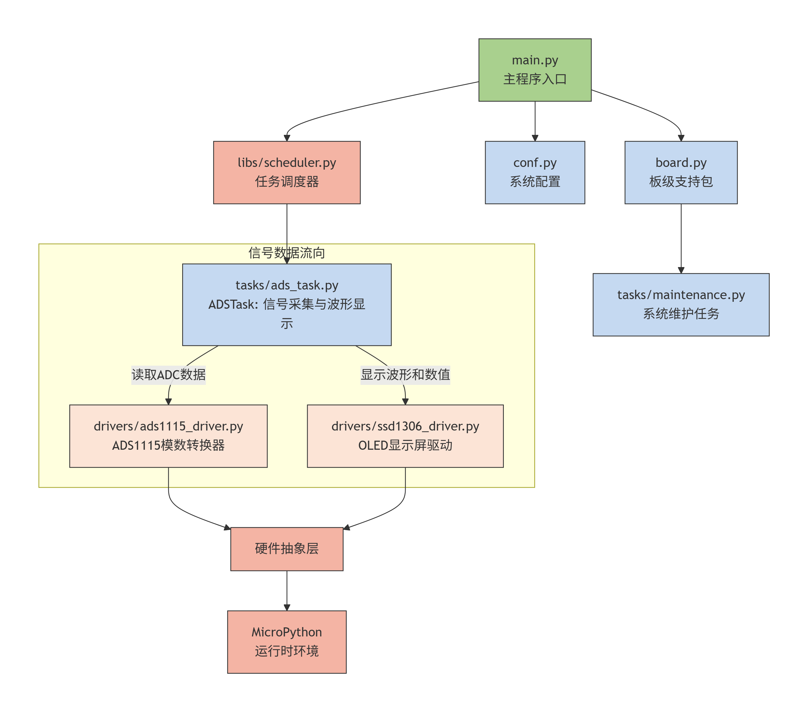
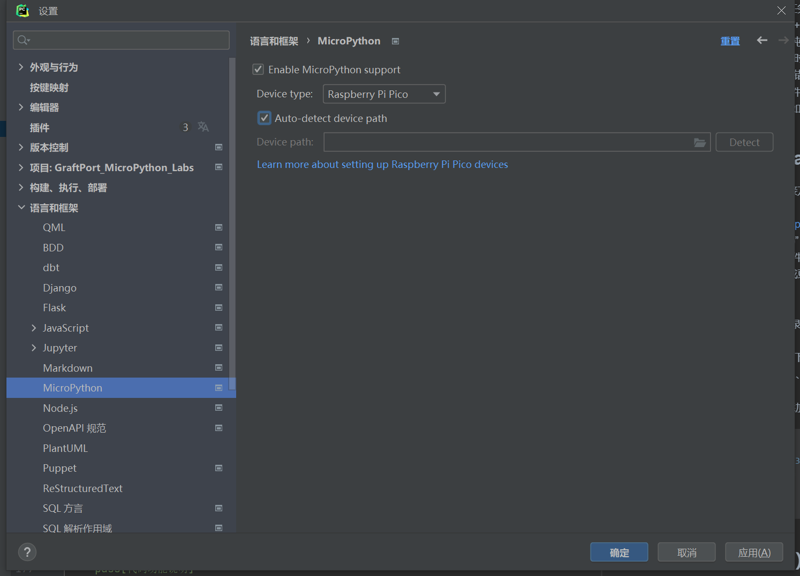
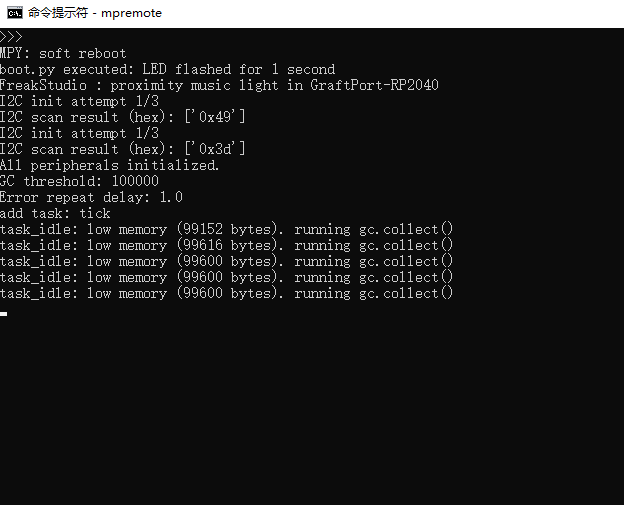

# 高精度波形采集装置（基于 GraftPort-RP2040 开发板）


# 目录
- [1. 简介](#1简介)
- [2. 主要功能](#2主要功能)
- [3. 硬件要求](#3硬件要求)
- [4. 软件环境](#4软件环境)
- [5. 文件结构](#5文件结构)
- [6. 关键文件说明](#6关键文件说明)
- [7. 软件设计核心思想](#7软件设计核心思想)
- [8. 使用说明](#8使用说明)
- [9. 示例程序](#9示例程序)
- [10. 注意事项](#10注意事项)
- [11. 版本记录](#11版本记录)
- [12. 联系开发者](#12联系开发者)
- [13. 许可协议](#13许可协议)
# 项目说明

## 1.简介

### **1.1 项目背景**

传统信号采集设备多为固定显示或单一功能，缺乏实时波形展示和可视化能力。本项目**基于 GraftPort-RP2040 开发板**，结合**基于 ADS1115 芯片的模数转换模块**和 **0.96 寸 SSD1306-OLED 模块**，实现"信号采集-波形显示-实时可视化"一体化系统，融入 `MicroPython` 的轻量化任务调度与异常处理机制，保证系统稳定运行。

### **1.2 项目主要功能概览、**

本项目基于 `MicroPython` 开发，核心功能是通过**基于 ADS1115 模数转换器模块**实时采集模拟信号，转换为数字波形，通过 `OLED` 显示屏实时显示波形图；支持板载按键中断切换任务启停，内置自动垃圾回收（`GC`）避免内存泄漏，异常捕获与限速打印便于问题定位。

### **1.3 适用场景或应用领域**

- **信号分析**：实时监测模拟信号波形，用于电路调试和信号分析；
- **教学演示**：用于 `MicroPython` 任务调度、`ADC` 数据采集、`I2C` 通信、波形显示等知识点的实践教学；
- **便携测量**：作为便携式信号采集设备，用于现场测试和故障诊断；
- **数据记录**：集成到数据采集系统中，提供实时波形显示功能。

## 2.主要功能

- **实时信号采集**：通过 `ADS1115` 模块每 50ms 采集一次模拟信号，保持高采样率；
- **OLED 实时波形显示**：通过 **0.96 寸 SSD1306-OLED 模块**实时显示信号波形，支持滚动显示；
- **按键中断交互**：板载按键触发下降沿中断，可切换核心任务"运行/暂停"，暂停时显示"`PAUSED`"；
- **自动内存管理**：空闲时检测内存，若低于阈值自动触发 `GC`，防止 `MicroPython` 因内存泄漏崩溃；
- **异常容错机制**：任务执行抛异常时，完整打印回溯信息并限速，避免刷屏；
- **板级适配灵活**：基于 `board.py` 实现引脚映射解耦，支持后续扩展其他 `RP2040` 开发板。

## 3.硬件要求

### 3.1 需要硬件

项目**基于 GraftPort-RP2040 开发板**作为主控：


**其余需要的模块包括：**


- **基于 ADS1115 模数转换器模块：**（`I2C` 通信，地址 `0x49`）；
- **0.96 寸 SSD1306-OLED 模块：**（`I2C` 通信，地址 `0x3c` 或 `0x3d`）；
- **GtaftSense-SY7656 锂电池充放电模块：**（连接聚合物锂电池，输出 5V 电压，带 `Type-C` 充电接口）；
- **板载按键：** 默认使用开发板固定引脚（引脚 18，上拉输入），无需额外接线；
- **板载 LED：** 默认使用开发板固定引脚（引脚 25），无需额外接线。

### 3.2 **硬件连线**

**基于 ADS1115 模数转换器模块**：通过 `PH2.0` 连接线接入 `I2C0` 接口；


**0.96 寸 SSD1306-OLED 模块**：通过 `PH2.0` 连接线接入 `I2C1` 接口；


**锂电池充放电模块**：`BAT` 接口连接锂电池，`OUT` 接口通过 `PH2.0-2P ` 连接线为主控板供电。


### 3.3 结构装配

**首先，使用 M3 塑料柱将各模块与主控板固定在外壳底板上（主控板与外壳均预留 M3 螺丝孔）：**


**接着，利用 M3 塑料柱将外壳四周固定好，并在对应位置拧上 M3 螺丝完成装配：**


### 3.4 注意事项

**在主控板不连接外部看门狗模块时，RUN 拨码开关 2 要导通：**


**锂电池充放电模块支持电量显示，使用下面 Type-C 接口即可充电：**


## 4.软件环境

- **核心固件：**`MicroPython v1.23.0`（需适配 `GraftPort-RP2040`，支持 `machine.Pin/I2C/Timer` 模块、软定时器调度）；
- **开发 IDE：**`PyCharm`（用于代码编写、上传、调试，支持 `MicroPython REPL` 交互，需要安装 `MicroPython` 插件）；
- **辅助工具：**

  - `Python 3.12+`（用于运行本地辅助脚本，如固件烧录脚本，可选）；
  - `mpy-cross v1.23.0`（用于将 `.py` 文件编译为 `.mpy`，减少开发板内存占用，可选）；
  - `mpremote v0.11.0+`（替代 `Thonny` 上传文件，支持命令行操作，可选）；
- **依赖模块：** 无额外第三方库，所有驱动（`passive_buzzer_driver.py` 等）均为自定义实现的，随项目文件提供。

## 5.文件结构

```
signal_waveform_acquisition
├─ LICENSE
├─ tools
│  ├─ dependency_analyzer.py
│  ├─ mpy_compiler.py
│  ├─ mpy_uploader.py
│  └─ README.md
├─ firmware
│  ├─ board.py
│  ├─ boot.py
│  ├─ conf.py
│  ├─ main.py
│  ├─ tasks
│  │  ├─ ads_task.py
│  │  ├─ maintenance.py
│  │  └─ __init__.py
│  ├─ libs
│  │  ├─ __init__.py
│  │  └─ scheduler
│  └─ drivers
│     ├─ __init__.py
│     ├─ pcf8574_driver
│     └─ ads1115_driver
├─ examples
├─ docs
└─ build
   └─ build_here
```

## 6.关键文件说明

- **main.py**：**项目入口，核心逻辑包括**：

  1. 上电延时 3 秒（等待硬件稳定），初始化板载 `LED`、`OLED`、`SI5351`、`PCF8574` 按键模块、按键（含中断注册）；
  2. 硬件初始化：`I2C` 总线扫描自动识别设备地址，`OLED` 菜单系统初始化；
  3. 创建 `sensor_task` 实例（传入硬件驱动与配置参数），封装为调度器任务（周期 200ms）；
  4. 初始化 `Scheduler`（软定时器，调度周期 50ms），添加任务并启动调度，进入无限循环；
  5. 定义 `button_handler` 中断回调（切换任务启停）、`fatal_hang` 阻塞函数（严重错误处理）。
- **tasks/ads_task.py**：**核心业务任务**，`ADSTask` **类关键逻辑**：

  1. `__init__`：初始化硬件实例和波形缓冲区；
  2. `tick`：每 50ms 执行一次，流程为"读取 `ADS1115` 数据 → 更新波形缓冲区 →`OLED` 更新显示"；
  3. `immediate_off`：暂停时立即清屏并显示"`PAUSED`"；
  4. `_map_raw_to_y`：将原始 ADC 值映射到屏幕 Y 坐标。
- **tasks/maintenance.py**：**系统维护模块，关键函数：**

  1. `task_idle_callback`：调度器空闲时触发，检测内存低于 `GC_THRESHOLD_BYTES`（默认 100000 字节）则执行 `gc.collect()`；
  2. `task_err_callback`：任务抛异常时触发，打印完整回溯信息（优先 `sys.print_exception`），并延时 `ERROR_REPEAT_DELAY_S`（默认 1 秒）防止刷屏；
  3. 支持从 `conf.py` 读取配置，无配置时使用默认值，保证兼容性。
- **drivers/xxx_driver**：**硬件驱动模块，均采用"实例化 + 方法调用"模式**：

  - `ads1115_driver`：`ADS1115` 类通过 `I2C` 通信，提供 `set_conv`、`read_rev`、`raw_to_v` 等方法；
  - `ssd1306_driver`：`SSD1306_I2C` 类通过 `I2C` 控制 `OLED` 显示，提供 `fill`、`text`、`line`、`show` 等方法；
- **board.py**：板级引脚映射模块，定义 `BOARDS` 字典（含 `GraftPort-RP2040` 的固定引脚、`I2C`/`DIO`/`ADC` 接口映射），提供 `get_fixed_pin`、`get_i2c_pins` 等接口，实现"板级配置与业务逻辑解耦"。
- **conf.py**：**用户配置文件，需用户手动定义的参数包括**：`I2C_INIT_MAX_ATTEMPTS`（传感器初始化重试次数）、`I2C_INIT_RETRY_DELAY_S`（重试间隔秒数）、`ENABLE_DEBUG`（调试打印开关）、`AUTO_START`（任务是否自动启动），无定义时系统使用默认值。

## 7.软件设计核心思想



- **系统分层思路**：采用"四层架构"，实现解耦与复用

  - **硬件驱动层（****drivers/****）**：仅负责硬件的底层控制，不包含业务逻辑，如 `ADS1115` 驱动只关心"如何获取 `ADC` 值"，不关心"如何显示波形"。
  - **任务逻辑层（****tasks/****）**：基于驱动层提供的接口实现业务逻辑，如 `ADSTask` 只调用驱动的 `read_rev` 方法获取数据，不关心 `I2C` 通信细节；只调用 `OLED` 的 `line` 和 `text` 方法显示内容，不关心 `I2C` 地址。
  - **调度控制层（****libs/scheduler.py****）**：提供通用的任务管理能力，支持任务添加/暂停/恢复、空闲/异常回调，不依赖具体业务；通过软定时器统一管理所有任务的执行时机。
  - **入口层（****main.py****）**：负责"组装"各层，初始化硬件 → 创建任务 → 启动调度，是系统的"胶水"，不包含核心业务逻辑。
- **模块划分原则**：高内聚、低耦合，便于维护与扩展

  - **高内聚：** 每个模块只负责单一职责，如 `maintenance.py` 仅处理系统维护（`GC`、异常），不涉及波形显示；`ads_task.py` 仅处理信号采集和波形显示逻辑，不关心硬件初始化。
  - **低耦合：** 模块间通过"接口"交互，而非直接操作内部变量，如 `ADSTask` 通过 `ADS1115.read_rev` 获取数据，不直接操作 `I2C` 寄存器；通过 `SSD1306_I2C.line()` 绘制波形，不直接控制 I2C 通信。
  - **扩展性：** 新增硬件时，只需在 `drivers/` 添加对应驱动，在 `tasks/` 创建新任务，无需修改现有代码；扩展开发板时，只需在 `board.py` 添加引脚映射，不影响业务逻辑。
- **核心机制**：保障系统稳定与用户体验

  - **任务调度机制**：基于软定时器（`Timer(-1)`）实现，调度周期 20ms，核心任务周期 50ms，通过"计数器累加"判断任务是否到执行时间，避免定时器嵌套冲突。
  - **波形显示机制**：采用"环形缓冲区"策略，实现波形滚动显示，既减少内存占用，又保证波形连续性；支持原始值和电压值同时显示。
  - **交互反馈机制**：按键中断回调"即时生效"，暂停时立即停止数据采集和显示更新，显示"`PAUSED`"状态；硬件初始化失败时"明确报错"（`LED` 闪烁 + 终端信息）。
  - **容错机制**：所有关键操作均用 `try-except` 包裹，避免单一模块故障导致整个系统崩溃；自动内存回收机制防止长时间运行的内存泄漏。
- **任务执行流程**：任务执行流程如下所示


## 8.使用说明

### **8.1 硬件连接**

按“硬件要求”中的连接方式，连接主控板、各个传感器模块和电池；

### **8.2 运行项目（使用 ****PyCharm + MicroPython ****插件）**

打开 `PyCharm` 并安装对应的 `MicroPython` 插件。


在插件中选择 **运行设备（**`Target Device`**）** 为 `RP2040`，并启用 **自动检测设备路径（**`Auto-detect device path`**）**。



将 ` Project/firmware` 设置为项目根目录。


**修改运行配置：**


- 勾选 **允许多个实例（****Allow multiple instances****）**
- 选择 **存储为项目文件（****Store as project file****）**
- 点击 **确定** 保存配置。

点击 `IDE` 右上角的绿色三角按钮运行，即可开始上传固件并执行项目。


### **8.3 运行配置的修改**

**您可以配置 ****conf.py****，根据需求修改或添加参数，例如**：

```python
# conf.py 示例配置
I2C_INIT_MAX_ATTEMPTS = 3      # 传感器初始化最多重试次数
I2C_INIT_RETRY_DELAY_S = 0.5   # 每次重试间隔（秒）
ENABLE_DEBUG = True            # 是否开启调试打印
AUTO_START = True              # 是否在启动时自动运行任务
```

### **8.4 功能测试**

**打开主控板下方的****VBAT****电池供电开关，可以看到主控板和模块上的电源指示灯亮起：**

- **信号采集**：将信号源连接到 `ADS1115` 的输入通道，观察 `OLED` 显示是否相应变化；
- **波形显示**：验证波形是否平滑滚动显示，数值显示是否正确；
- **按键切换**：按下板载按键，任务暂停（显示"`PAUSED`"），再次按下恢复。

在 `conf.py` 中配置不变同时硬件连接没有问题的情况下，程序可以正常运行


**终端输出结果如下所示：**



### **8.5 调试与问题定位**

- 若功能异常，确保 `ENABLE_DEBUG = True`，在终端查看调试信息，判断数据是否正常；
- 若传感器初始化失败，检查硬件连接、电源、`I2C` 地址配置；
- 若 `OLED` 不显示，检查 `I2C` 地址是否正确（`0x3c` 或 `0x3d`），以及 `I2C` 总线是否正常；
- 若波形显示异常，检查 `ADS1115` 配置和输入信号范围。

## 9.示例程序

本项目没有其余参考示例代码，直接在 `firmware` 文件夹中进行修改即可。

## 10.注意事项

- **传感器相关**：

  - `ADS1115` 模块需要适当的信号输入范围，避免超过其工作电压；
  - 信号输入应避免噪声干扰，必要时添加滤波电路。
- **硬件连接相关**：

  - `ADS1115` 模块的 `I2C` 地址必须设置为 `0x49`；
  - **0.96 寸 SSD1306-OLED 模块**的 `I2C` 地址可能为 `0x3c` 或 `0x3d`，系统会自动检测。
- **软件版本相关**：

  - 必须使用 `MicroPython v1.23.0` 及以上版本；
  - 调试打印会占用一定内存，正式使用时建议关闭。
- **功能使用相关**：

  - 任务周期（50ms）不建议修改过小，否则可能增加系统负载；
  - 自动 `GC` 阈值建议根据实际内存使用情况调整。

## 11.版本记录

## 12.联系开发者

**如有任何问题或需要帮助，请通过以下方式联系开发者：**
📧 **邮箱**：<u>10696531183@qq.com</u>
💻 **GitHub**：<u>[https://github.com/FreakStudioCN](https://github.com/FreakStudioCN)</u>

## 13.许可协议

本项目中，除 `machine` 等 `MicroPython` 官方模块（`MIT` 许可证）外，所有由作者编写的驱动与扩展代码均采用 **知识共享署名-非商业性使用 4.0 国际版 (CC BY-NC 4.0)** 许可协议发布。

**您可以自由地：**

- **共享** — 在任何媒介以任何形式复制、发行本作品
- **演绎** — 修改、转换或以本作品为基础进行创作

**惟须遵守下列条件：**

- **署名** — 您必须给出适当的署名，提供指向本许可协议的链接，同时标明是否（对原始作品）作了修改。您可以用任何合理的方式来署名，但是不得以任何方式暗示许可人为您或您的使用背书。
- **非商业性使用** — 您不得将本作品用于商业目的。
- **合理引用方式** — 可在代码注释、文档、演示视频或项目说明中明确来源。

**版权归 FreakStudio 所有。**

# 附件一：项目源代码下载

# 附件二：硬件模块参考资料

基于 ADS1115 模数转换器模块

0.96 寸 SSD1306-OLED 模块

[GraftSense-基于 SY7656 芯片的锂电池充放电模块（开放版）](https://f1829ryac0m.feishu.cn/docx/C3RFd6XGEowEwOxb3plc7C5CnBb?from=from_copylink)

[GraftPort-RP2040 开发板](https://f1829ryac0m.feishu.cn/docx/ZHdjdPdCwonbLyxVeAdcehG4n8b?from=from_copylink)

# 版本记录

<table>
<tr>
<td>文档版本<br/></td><td>修改日期<br/></td><td>修改人<br/></td><td>修改内容<br/></td></tr>
<tr>
<td>V1.0.0<br/></td><td>2025-11-03<br/></td><td>侯钧瀚<br/></td><td>编写文档初稿。<br/></td></tr>
<tr>
<td><br/></td><td><br/></td><td><br/></td><td><br/></td></tr>
</table>
