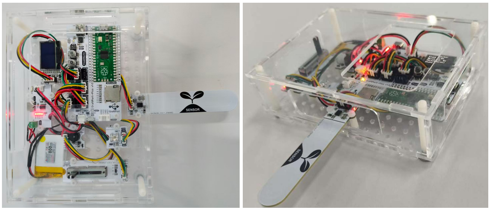
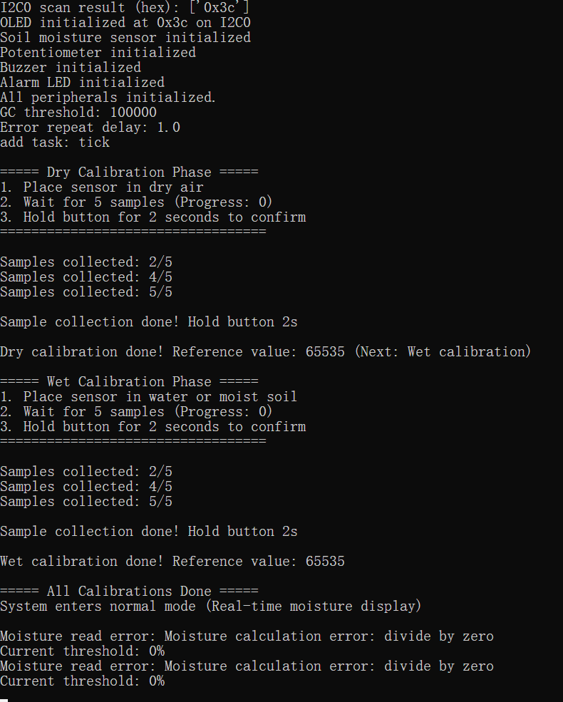

# 绿植健康智能监护与补水提醒装置（基于 GraftPort-RP2040 开发板）




# 目录
- [1. 简介](#1简介)
- [2. 主要功能](#2主要功能)
- [3. 硬件要求](#3硬件要求)
- [4. 软件环境](#4软件环境)
- [5. 文件结构](#5文件结构)
- [6. 关键文件说明](#6关键文件说明)
- [7. 软件设计核心思想](#7软件设计核心思想)
- [8. 使用说明](#8使用说明)
- [9. 示例程序](#9示例程序)
- [10. 注意事项](#10注意事项)
- [11. 版本记录](#11版本记录)
- [12. 联系开发者](#12联系开发者)
- [13. 许可协议](#13许可协议)
# **项目说明**

## **1.简介**

### **1.1 项目背景**

传统植物养护依赖人工经验判断土壤湿度，存在浇水不及时或过量的问题，且缺乏直观的状态反馈机制。本项目基于 **GraftPort-RP2040 开发板**，整合**基于 NE555 的模拟电容式土壤湿度传感器模块**、**0.96 寸 SSD1306-OLED 模块**、**无源蜂鸣器模块**报警等模块，实现“湿度采集-阈值判断-智能提醒”的自动化流程，解决传统养护方式的主观性与滞后性问题。同时融入 `MicroPython` 轻量化任务调度与异常处理机制，确保系统在嵌入式环境下稳定可靠运行。

### **1.2 项目主要功能概览**

本项目基于 `MicroPython` 开发，核心功能是通过**基于 NE555 的模拟电容式土壤湿度传感器**模块实时采集土壤水分数据，经滤波处理后与可调节阈值（通过滑动变阻器手动设置）对比；当湿度低于阈值时，触发**无源蜂鸣器模块**报警与 `LED` 闪烁提示，同时在 `OLED` 屏幕上显示当前湿度、阈值及报警状态；支持板载按键中断控制任务启停与传感器校准，内置自动垃圾回收（`GC`）避免内存泄漏，异常捕获机制便于问题定位。

### **1.3 适用场景或应用领域**

- **家庭园艺：** 为盆栽植物提供精准浇水提醒，避免因遗忘或误判导致植物枯萎；
- **智能温室：** 作为小型监测节点，实时反馈特定区域土壤湿度状态；
- **教学演示：** 用于 `MicroPython` 传感器交互、`PWM` 控制、**0.96 寸 SSD1306-OLED 模块**、任务调度等知识点的实践教学；
- **创客项目：** 作为轻量化环境监测模块，快速集成到智能农业作品中。

## 2.主要功能

- **实时湿度采集与滤波**：**基于 NE555 的模拟电容式土壤湿度传感器模块**每 500ms 采集一次数据，采用“五点均值滤波”机制，过滤瞬时干扰，保证数据稳定性；
- **阈值灵活调节**：通过**滑动变阻器**手动设置湿度报警阈值，支持 0-100% 范围自定义，适配不同植物的生长需求；
- **多方式报警提醒**：湿度低于阈值时，**无源无源蜂鸣器模块**发出间歇报警声，**食人鱼 LED 灯模块**同步闪烁，同时**蜂鸣器**报警屏幕显示报警标识，多维度反馈状态；
- **按键中断交互**：板载按键触发下降沿中断，短按切换任务“运行/暂停”，长按 2 秒进入传感器校准模式，操作直观高效；
- **可视化数据展示**：**SSD1306 OLED 屏幕**实时显示当前土壤湿度值、设定阈值及系统状态（运行/暂停/校准），信息一目了然；
- **自动内存管理**：系统空闲时检测内存，若低于阈值（默认 100000 字节）自动触发 GC，防止 `MicroPython` 因内存碎片导致运行异常；
- **多板级适配**：基于 `board.py` 实现引脚映射解耦，支持后续扩展其他 RP2040 开发板，核心业务逻辑无需修改。

## 3.硬件要求

### 3.1 需要硬件

项目基于 **GraftPort-RP2040 开发板**作为主控：


**其余需要的模块包括：**


- **基于 NE555 的模拟电容式土壤湿度传感器模块**：`ADC`;


- **滑动变阻器**：`ADC`;


- **0.96 寸 SSD1306-OLED 模块**：（`I2C` 通信，地址 `0x3c` 或 `0x3d`）；


- **无源无源蜂鸣器模块：**`PWM`;


- **食人鱼 LED 灯模块**（支持 `PWM` 调光）;


### 3.2 **硬件连线**

**锂电池充放电模块**：`BAT` 接口连接锂电池，`OUT` 接口通过 `PH2.0-2P ` 连接线为主控板供电。


### 3.3 结构装配

**首先，使用 M3 塑料柱将各模块与主控板固定在外壳底板上（主控板与外壳均预留 M3 螺丝孔）：**


**接着，利用 M3 塑料柱将外壳四周固定好，并在对应位置拧上 M3 螺丝完成装配：**


### 3.4 注意事项

**在主控板不连接外部看门狗模块时，RUN 拨码开关 2 要导通：**


**锂电池充放电模块支持电量显示，使用下面**`Type-C`**接口即可充电：** 


## 4.软件环境

- **核心固件：**`MicroPython v1.23.0`（需适配 `GraftPort-RP2040`，支持 `machine.Pin/I2C/Timer` 模块、软定时器调度）；
- **开发 IDE：**`PyCharm`（用于代码编写、上传、调试，支持 `MicroPython REPL` 交互，需要安装 `MicroPython` 插件）；
- **辅助工具：**

  - `Python 3.12+`（用于运行本地辅助脚本，如固件烧录脚本，可选）；
  - `mpy-cross v1.23.0`（用于将 `.py` 文件编译为 `.mpy`，减少开发板内存占用，可选）；
  - `mpremote v0.11.0+`（替代 `Thonny` 上传文件，支持命令行操作，可选）；
- **依赖模块：** 无额外第三方库，所有驱动（`passive_buzzer_driver.py` 等）均为自定义实现的，随项目文件提供。

## 5.文件结构

```
soil_moisture_reminder
├─ .flake8
├─ LICENSE
├─ README.md
├─ tools
│  ├─ dependency_analyzer.py
│  ├─ mpy_compiler.py
│  ├─ mpy_uploader.py
│  └─ README.md
├─ firmware
│  ├─ board.py
│  ├─ boot.py
│  ├─ conf.py
│  ├─ main.py
│  ├─ tasks
│  │  ├─ maintenance.py
│  │  ├─ sensor_task.py
│  │  └─ __init__.py
│  ├─ libs
│  │  ├─ __init__.py
│  │  └─ scheduler
│  └─ drivers
│     ├─ __init__.py
│     ├─ ssd1306_driver
│     ├─ soil_moisture_driver
│     ├─ potentiometer_driver
│     ├─ piranha_led_driver
│     └─ passive_buzzer_driver
├─ examples
│  └─ README.md
└─ docs
```

## 6.关键文件说明

- **main.py**：项目入口，核心逻辑包括：

  1. 上电延时 3 秒等待硬件稳定，通过 `board.py` 初始化各模块引脚（`OLED`、无源蜂鸣器模块、`LED`、按键等）；
  2. 初始化 `I2C总线` 与 **0.96 寸 SSD1306-OLED 模块**、各传感器模块，支持多次重试，失败则调用 `fatal_hang` 阻塞并闪灯报错；
  3. 创建 `SoilMonitorTask` 实例（传入驱动对象与配置参数），封装为调度器任务（周期 500ms）；
  4. 初始化调度器（软定时器，调度周期 100ms），添加核心任务与维护任务，启动调度并进入无限循环；
  5. 定义按键中断回调函数，实现任务启停与校准模式切换。
- **drivers/xxx_driver**：硬件驱动模块，均采用“实例化 + 方法调用”模式，屏蔽底层细节：

  - `soil_moisture_driver.py`：`SoilMoistureSensor` 类通过 `ADC` 读取传感器信号，`read_humidity()` 返回归一化后的湿度值（`0-100%`）；
  - `potentiometer_driver.py`：`Potentiometer` 类通过 `ADC` 采集滑动变阻器信号，`read_value()` 返回阈值（`0-100%`）；
  - `ssd1306_driver.py`：`SSD1306OLED` 类通过 `I2C` 控制显示屏，`display_data()` 接收湿度、阈值等参数并显示；
  - `passive_buzzer_driver.py`：`Buzzer` 类通过 `PWM` 输出信号，`play_tone(freq, duration)` 控制报警声频率与时长；
  - `piranha_led_driver.py`：`PiranhaLED` 类通过 `PWM` 控制亮度，支持常亮与闪烁模式。
- **tasks/**：任务逻辑模块：

  - `sensor_task.py`：`SoilMonitorTask` 类关键逻辑：
    1. `__init__`：初始化硬件实例、滤波缓冲（容量 5）、校准参数；
    2. `tick`：每 500ms 执行一次，流程为“读取湿度与阈值 → 均值滤波 → 阈值对比 → 控制报警与显示”；
    3. `calibrate_dry()`/`calibrate_wet()`：分别完成干燥与湿润环境的校准，提升湿度检测精度；
    4. `pause()`/`resume()`：暂停时关闭报警与 LED，恢复时重置滤波缓冲，避免数据异常。
  - `maintenance.py`：系统维护模块，`task_idle_callback` 在调度器空闲时触发 GC，`task_err_callback` 捕获任务异常并限速打印错误信息。
- **board.py**：板级引脚映射模块，定义 `BOARDS` 字典（含 **GraftPort-RP2040** 的固定引脚、I2C/`ADC`/`PWM` 接口映射），提供 `get_pin` 接口，扩展其他开发板时仅需修改该文件。
- **conf.py**：用户配置文件，可自定义参数：`AUTO_START`（任务是否自动启动）、`ENABLE_DEBUG`（调试打印开关）、`GC_THRESHOLD_BYTES`（GC 触发阈值）、`ERROR_REPEAT_DELAY_S`（错误打印间隔）等，无配置时使用默认值。-

## 7.软件设计核心思想、


- **系统分层思路**：解耦与复用
  - **硬件驱动层**（`drivers/`）：仅负责外设底层控制，不包含业务逻辑，如 `OLED` 驱动只关心“如何显示数据”，不关心“显示什么数据”；
  - **任务逻辑层**（`tasks/`）：基于驱动层接口实现业务流程，`SoilMonitorTask` 调用驱动方法完成监测与反馈，不依赖具体引脚配置；
  - **调度控制层**（`libs/scheduler.py`）：提供通用任务管理能力，支持任务周期调度、暂停/恢复、异常回调，适配多场景需求；
  - **入口层**（`main.py`）：负责“组装”各模块，初始化硬件 → 创建任务 → 启动调度，简化系统搭建流程。
- **模块划分原则**：高内聚,低耦合

  - **高内聚**：每个模块聚焦单一功能，如 `maintenance.py` 仅处理系统维护（`GC`、异常），不参与监测逻辑；
  - **低耦合**：模块间通过接口交互，如任务逻辑通过 `read_humidity()` 获取数据，不直接操作传感器 ADC 寄存器；
  - **扩展性**：新增功能（如远程通知）时，只需在 `tasks/` 添加新任务，无需修改现有驱动代码。
- **核心机制**：保障稳定性与用户体验

  - **数据滤波机制**：五点均值滤波过滤传感器噪声，避免误报警；
  - **交互反馈机制**：按键操作即时响应，校准过程在 `OLED` 上提示，提升操作便捷性；
  - **容错机制**：传感器初始化重试、硬件操作异常捕获，确保单一模块故障不导致系统崩溃。
- **任务执行流程**：任务执行流程如下所示


## 8.使用说明

### **8.1 硬件连接**

按“硬件要求”中的连接方式，连接主控板、各个传感器模块和电池；

### **8.2 运行项目（使用 PyCharm + MicroPython 插件）**

打开 `PyCharm` 并安装对应的 `MicroPython` 插件。


在插件中选择 ` ` **运行设备（Target Device）** 为 `RP2040`，并启用 **自动检测设备路径（Auto-detect device path）**。


将 ` ` **Project/firmware** 设置为项目根目录。


**修改运行配置：**


- 勾选 **允许多个实例（Allow multiple instances）**
- 选择 **存储为项目文件（Store as project file）**
- 点击 **确定** 保存配置。

点击 `IDE` 右上角的绿色三角按钮运行，即可开始上传固件并执行项目。


### **8.3 运行配置的修改**

您可以配置 `conf.py`，根据需求修改或添加参数，例如：

```python
# conf.py 示例配置
I2C_INIT_MAX_ATTEMPTS = 3      # 传感器初始化最多重试次数
I2C_INIT_RETRY_DELAY_S = 0.5   # 每次重试间隔（秒）
ENABLE_DEBUG = True            # 是否开启调试打印
AUTO_START = True              # 是否在启动时自动运行任务
```

### **8.4 功能测试**

- **土壤湿度检测：**将**基于 NE555 的模拟电容式土壤湿度传感器模块** 分别放置在干燥和湿润的环境中，观察 **0.96 寸 SSD1306-OLED 模块** 的湿度百分比是否相应变化；
- **阈值设置：** 旋转滑动变阻器，观察 **0.96 寸 SSD1306-OLED 模块** 的阈值百分比是否在 0-100% 范围内变化；
- **报警功能：** 当湿度低于阈值时，检查 `LED` 是否闪烁，**无源蜂鸣器模块**是否发出报警声；
- **校准功能：** 按照校准流程（干燥校准和湿润校准）进行校准，验证校准后湿度读数是否准确；
- **按键切换：** 短按板载按键，任务暂停（停止数据采集和显示更新，关闭报警），再次按下恢复。


终端输出结果如下所示：



### **8.5 调试与问题定位**

- 若 `OLED` 不显示，检查 `I2C` 地址是否正确（`0x3c` 或 `0x3d`），以及 `I2C` 总线是否正常；
- 湿度值显示 `0%` 或 `100%` 不变,验证 `ADC` 引脚配置,检查传感器接线;
- 无报警声或 `LED` 不闪烁,检查无源蜂鸣器模块 `PWM` 引脚配置,测试阈值比较逻辑

## 9.示例程序

本项目没有其余参考示例代码，直接在 `firmware` 文件夹中进行修改即可。

## 10.注意事项

- **传感器相关**

  - **基于 NE555 的模拟电容式土壤湿度传感器模块**探针需完全插入土壤，避免接触石块、金属等杂物，影响检测精度；
  - 传感器长期使用后可能出现氧化，定期清洁探针表面以保证测量准确性；
  - 避免传感器长时间浸泡在水中，非防水型号可能因渗水损坏；
  - 传感器校准应在稳定的环境温度下进行，温度变化会影响测量结果；
- **硬件连接相关**

  - 所有模块供电电压必须严格控制在 3.3V，超过 3.6V 可能损坏主控芯片；
  - `I2C` 总线需正确连接上拉电阻（通常 `4.7kΩ`），否则通信不稳定；
  - **无源蜂鸣器模块**正负极必须正确连接，接反会导致无声或损坏；
  - **0.96 寸 SSD1306-OLED 模块**的 `I2C` 地址若存在冲突（默认 `0x3C`），需修改驱动中的地址参数；
  - **基于 NE555 的模拟电容式土壤湿度传感器模块**与**滑动变阻器**应连接到不同的 `ADC` 引脚，避免信号干扰；
- **软件版本相关**

  - 必须使用 `MicroPython v1.23.0` 及以上版本，低版本可能不支持软定时器调度；
  - 确认固件适配**基于 GraftPort-RP2040 开发板**，其他 `RP2040` 开发板需修改 `board.py` 引脚映射；
  - 调试打印（`ENABLE_DEBUG=True`）会占用系统资源，正式使用时建议关闭；
- **功能使用相关**

  - **干燥校准：** 将传感器放置在通风干燥的空气中，避免阳光直射和潮湿环境；
  - **湿润校准：** 将传感器完全插入纯净水或充分湿润的土壤中，确保探针充分接触；
  - **校准操作要点：**
    - 每个校准阶段必须采集满 5 个样本，样本不足时校准确认会失败；
    - 长按按键需持续 2 秒以上，直到听到确认提示音方可松开；
    - 校准过程中避免移动传感器，确保样本数据的一致性；
    - 如校准结果不理想，可重新上电重启系统，按流程再次校准；

## 11.版本记录

- **v1.0.0(2025-11-04)**：缪贵成完成初始版本，实现核心功能：
  - 土壤湿度实时采集与滤波处理；
  - **滑动变阻器**调节阈值，多方式报警提醒；
  - 按键控制任务启停与传感器校准；
  - 适配**基于 GraftPort-RP2040 开发板**，提供完整驱动与任务代码。

## 12.联系开发者

如有任何问题或需要帮助，请通过以下方式联系开发者：
📧 **邮箱**：<u>10696531183@qq.commailto:10696531183@qq.com</u>
💻 **GitHub**：<u>[https://github.com/FreakStudioCN](https://github.com/FreakStudioCN)</u>

## 13.许可协议

本项目中，除 `machine` 等 `MicroPython` 官方模块（MIT 许可证）外，所有由作者编写的驱动与扩展代码均采用 **知识共享署名-非商业性使用 4.0 国际版 (CC BY-NC 4.0)** 许可协议发布。

您可以自由地：

- **共享** — 在任何媒介以任何形式复制、发行本作品
- **演绎** — 修改、转换或以本作品为基础进行创作

惟须遵守下列条件：

- **署名** — 您必须给出适当的署名，提供指向本许可协议的链接，同时标明是否（对原始作品）作了修改。您可以用任何合理的方式来署名，但是不得以任何方式暗示许可人为您或您的使用背书。
- **非商业性使用** — 您不得将本作品用于商业目的。
- **合理引用方式** — 可在代码注释、文档、演示视频或项目说明中明确来源。

**版权归 FreakStudio 所有。**

# 附件一：项目源代码下载

# 附件二：硬件模块参考资料

0.96 寸 SSD1306-OLED 模块

滑动变阻器模块

基于 NE555 的模拟电容式土壤湿度传感器模块

[GraftSense-无源蜂鸣器模块(开放版)](https://f1829ryac0m.feishu.cn/docx/HhiZd9es9ocGrxxA27ycxDXknmc?from=from_copylink)

[GraftPort-RP2040 开发板](https://f1829ryac0m.feishu.cn/docx/ZHdjdPdCwonbLyxVeAdcehG4n8b?from=from_copylink)

# 版本记录

<table>
<tr>
<td>文档版本<br/></td><td>修改日期<br/></td><td>修改人<br/></td><td>修改内容<br/></td></tr>
<tr>
<td>V1.0.0<br/></td><td>2025-11-04<br/></td><td>侯钧瀚<br/></td><td>编写文档初稿。<br/></td></tr>
<tr>
<td><br/></td><td><br/></td><td><br/></td><td><br/></td></tr>
</table>
