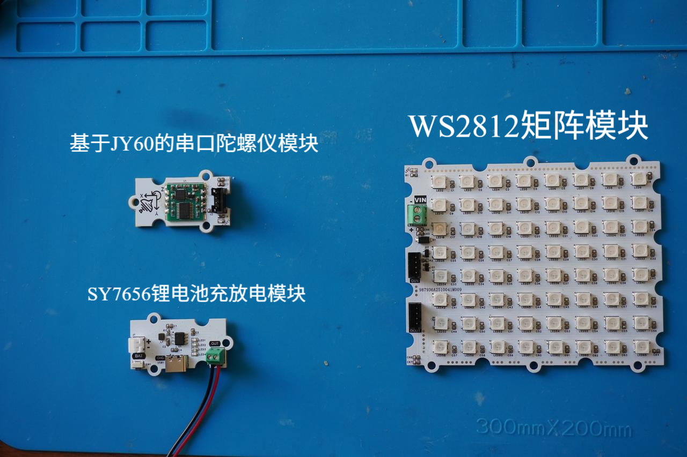
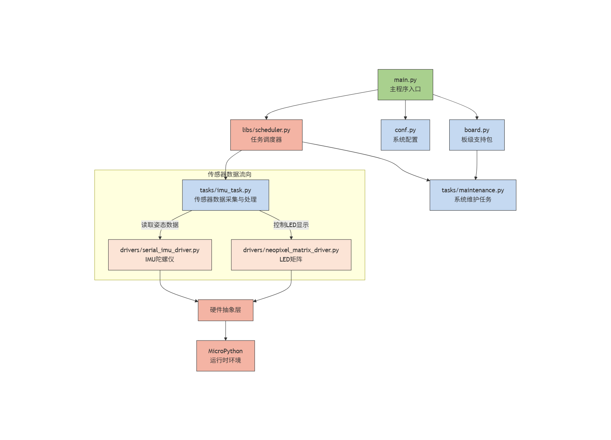
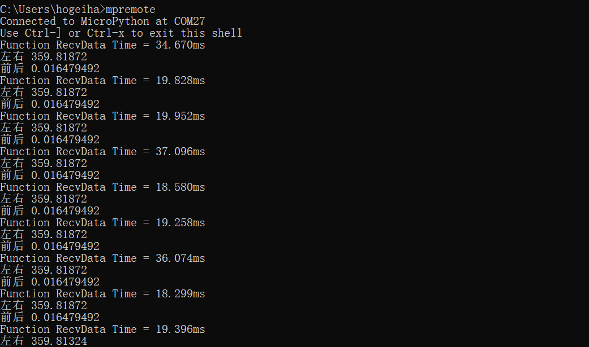

# 姿态感应交互装置（基于 GraftPort-RP2040 开发板）


## 1.简介

### **1.1 项目背景**

传统 `LED` 显示设备多为静态或简单动画显示，缺乏与用户姿态的实时交互能力。本项目**基于 GraftPort-RP2040 开发板**，结合**基于 JY60 的串口陀螺仪模块**和 8×8 **WS2812 矩阵模块**，实现"姿态感应-动态显示"交互系统，解决传统显示设备交互性不足的问题，同时融入 `MicroPython` 的轻量化任务调度与中断处理机制，保证系统稳定运行。

### **1.2 项目主要功能概览**

本项目基于 `MicroPython` 开发，核心功能是通过**基于 JY60 的串口陀螺仪模块**实时检测设备姿态（横滚角和俯仰角），根据姿态变化动态调整 `LED` 矩阵上图案的位置；支持板载按键中断切换任务启停，内置自动垃圾回收（`GC`）避免内存泄漏，异常捕获与限速打印便于问题定位。

### **1.3 适用场景或应用领域**

- **互动娱乐：** 作为姿态感应游戏设备，通过倾斜设备控制屏幕元素移动；
- **教学演示：** 用于 `MicroPython` 任务调度、`UART` 通信、姿态检测、`LED` 控制等知识点的实践教学；
- **智能设备：** 集成到可穿戴设备中，提供直观的姿态反馈显示；
- **原型开发：** 作为姿态感应交互界面的快速原型验证平台。

## 2.主要功能

- **实时姿态检测：** 通过**基于 JY60 的串口陀螺仪模块**每 50ms 采集一次设备姿态数据（横滚角、俯仰角）；
- **动态 LED 显示：** 通过 8×8 **WS2812 矩阵模块**实时显示可移动图案，根据姿态变化调整图案位置；
- **按键中断交互：** 板载按键触发下降沿中断，可切换核心任务"运行/暂停"，暂停时停止数据采集和显示更新；
- **自动内存管理：** 空闲时检测内存，若低于阈值自动触发 `GC`，防止 `MicroPython` 因内存泄漏崩溃；
- **异常容错机制：** 任务执行抛异常时，完整打印回溯信息并限速，避免刷屏；
- **板级适配灵活：** 基于 `board.py` 实现引脚映射解耦，支持后续扩展其他 `RP2040` 开发板。

## 3.硬件要求

### 3.1 需要硬件

项目**基于 GraftPort-RP2040 开发板**作为主控：


**其余需要的模块包括：**



- **基于 JY60 的串口陀螺仪模块**（`UART` 通信，默认波特率 115200）；
- **WS2812 矩阵模块**（数字输出，连接<u>DIO</u>引脚）；
- **SY7656 锂电池充放电模块**（连接聚合物锂电池，输出 5V 电压，带 `Type-C` 充电接口）；
- **板载按键：** 默认使用开发板固定引脚（引脚 18，上拉输入），无需额外接线；
- **板载 LED：** 默认使用开发板固定引脚（引脚 25），无需额外接线。

### 3.2 **硬件连线**

**基于 JY60 的串口陀螺仪模块**：通过 `PH2.0` 连接线接入 `UART0` 接口；


**WS2812 矩阵模块**：通过 `PH2.0` 连接线接入 `DIO0` 接口；


**锂电池充放电模块：**`BAT` 接口连接锂电池，`OUT` 接口通过 `PH2.0-2P` 连接线为主控板供电。


### 3.3 结构装配

**首先，使用 M3 塑料柱将各模块与主控板固定在外壳底板上（主控板与外壳均预留 M3 螺丝孔）：**


**接着，利用 M3 塑料柱将外壳四周固定好，并在对应位置拧上 M3 螺丝完成装配：**


### 3.4 注意事项

**在主控板不连接外部看门狗模块时，RUN 拨码开关 2 要导通：**


锂电池充放电模块支持电量显示，使用下面 `Type-C` 接口即可充电：


## 4.软件环境

- **核心固件：**`MicroPython v1.23.0`（需适配 `GraftPort-RP2040`，支持 `machine.Pin/I2C/Timer` 模块、软定时器调度）；
- **开发 IDE：**`PyCharm`（用于代码编写、上传、调试，支持 `MicroPython REPL` 交互，需要安装 `MicroPython` 插件）；
- **辅助工具：**

  - `Python 3.12+`（用于运行本地辅助脚本，如固件烧录脚本，可选）；
  - `mpy-cross v1.23.0`（用于将 `.py` 文件编译为 `.mpy`，减少开发板内存占用，可选）；
  - `mpremote v0.11.0+`（替代 `Thonny` 上传文件，支持命令行操作，可选）；
- **依赖模块：** 无额外第三方库，所有驱动（`passive_buzzer_driver.py` 等）均为自定义实现的，随项目文件提供。

## 5.文件结构

```
ws2812_imu_hourglass
├─ LICENSE
├─ tools
│  ├─ dependency_analyzer.py
│  ├─ mpy_compiler.py
│  ├─ mpy_uploader.py
│  └─ README.md
├─ firmware
│  ├─ board.py
│  ├─ boot.py
│  ├─ conf.py
│  ├─ main.py
│  ├─ tasks
│  │  ├─ imu_task.py
│  │  ├─ maintenance.py
│  │  └─ __init__.py
│  ├─ libs
│  │  ├─ __init__.py
│  │  └─ scheduler
│  └─ drivers
│     ├─ __init__.py
│     ├─ serial_imu_driver
│     └─ neopixel_matrix_driver
├─ examples
│  └─ README.md
├─ docs
   └─ docs_here
```

## 6.关键文件说明

- `main.py` ** ：项目入口，核心逻辑包括：**

  1. 上电延时 3 秒（等待硬件稳定），初始化板载 `LED`、`IMU` 陀螺仪、`LED` 矩阵、按键（含中断注册）；
  2. 硬件初始化：`IMU` 陀螺仪（UART 通信）、`LED` 矩阵（`NeoPixel` 控制）；
  3. 创建 `ImuTask` 实例（传入硬件驱动与配置参数），封装为调度器任务（周期 50ms）；
  4. 初始化 `Scheduler`（软定时器，调度周期 10ms），添加任务并启动调度，进入无限循环；
  5. 定义 `button_handler` 中断回调（切换任务启停）、fatal_hang 阻塞函数（严重错误处理）。
- `tasks/imu_task.py`**：核心业务任务，ImuTask类关键逻辑：**

  1. `__init__`：初始化硬件实例，创建初始图案，设置初始位置；
  2. `tick`：每 50ms 执行一次，流程为"读取 `IMU` 数据 → 计算新位置 → 更新 `LED` 显示"；
  3. `_make_pattern`：创建 2×2 红色方块图案；
  4. `_draw_pattern`：将当前图案绘制到 LED 矩阵上。
- `tasks/maintenance.py` **：系统维护模块，关键函数：**

  1. `task_idle_callback`：调度器空闲时触发，检测内存低于 `GC_THRESHOLD_BYTES`（默认 100000 字节）则执行 `gc.collect()`；
  2. `task_err_callback`：任务抛异常时触发，打印完整回溯信息（优先 `sys.print_exception`），并延时 `ERROR_REPEAT_DELAY_S`（默认 1 秒）防止刷屏；
  3. 支持从 `conf.py` 读取配置，无配置时使用默认值，保证兼容性。
- `drivers/xxx_driver`**：硬件驱动模块，均采用"实例化 + 方法调用"模式，仅暴露与硬件相关的控制接口，屏蔽底层细节：**

  - `neopixel_matrix_driver`：`NeopixelMatrix` 类通过数字引脚控制 LED 矩阵，提供 `fill`、`pixel`、`show` 等方法；
  - `serial_imu_driver`：`IMU` 类通过 `UART` 串口通信，`RecvData` 方法读取姿态数据，`angle_x`/`angle_y` 属性返回横滚角和俯仰角。
- `board.py`**：** 板级引脚映射模块，定义 BOARDS 字典（含 GraftPort-RP2040 的固定引脚、UART/DIO 接口映射），提供 `get_fixed_pin`、`get_uart_pins`、`get_dio_pins` 等接口，实现"板级配置与业务逻辑解耦"，后续扩展其他开发板只需添加 `BOARDS` 子项。
- `conf.py`**：** 用户配置文件，需用户手动定义的参数包括：`ENABLE_DEBUG`（调试打印开关）、`AUTO_START`（任务是否自动启动），无定义时系统使用默认值。

## 7.软件设计核心思想



- **系统分层思路：** 采用"四层架构"，实现解耦与复用

  - **硬件驱动层（`drivers/`）：** 仅负责硬件的底层控制，不包含业务逻辑，如 `IMU` 驱动只关心"如何获取姿态数据"，不关心"如何显示"；`LED` 矩阵驱动只关心"如何控制 `LED`"，不关心"显示什么内容"。
  - **任务逻辑层（`tasks/`）：** 基于驱动层提供的接口实现业务逻辑，如 `ImuTask` 只调用驱动的 `RecvData` 方法获取数据，不关心 `IMU` 的 `UART` 配置；只调用 `pixel` 和 `show` 方法显示内容，不关心 `LED` 矩阵的引脚配置。
  - **调度控制层（`libs/scheduler.py`）：** 提供通用的任务管理能力，支持任务添加/暂停/恢复、空闲/异常回调，不依赖具体业务；通过软定时器统一管理所有任务的执行时机，确保系统资源合理分配。
  - **入口层（`main.py`）：** 负责"组装"各层，初始化硬件 → 创建任务 → 启动调度，是系统的"胶水"，不包含核心业务逻辑；处理硬件异常和用户交互，确保系统稳定启动和运行。
- 模块划分原则：高内聚、低耦合，便于维护与扩展

  - **高内聚：** 每个模块只负责单一职责，如 `maintenance.py` 仅处理系统维护（`GC`、异常），不涉及姿态检测；`imu_task.py` 仅处理姿态数据采集和显示逻辑，不关心硬件初始化；每个驱动模块仅封装对应硬件的控制方法。
  - **低耦合：** 模块间通过"接口"交互，而非直接操作内部变量，如 `ImuTask` 通过 `IMU.RecvData()` 获取数据，不直接操作 `UART` 硬件；通过 `NeopixelMatrix.pixel()` 显示内容，不直接控制 `NeoPixel` 通信协议。
  - **扩展性：** 新增硬件（如其他传感器）时，只需在 `drivers/` 添加对应驱动，在 tasks/创建新任务，无需修改现有代码；扩展开发板时，只需在 `board.py` 添加引脚映射，不影响业务逻辑；新增交互逻辑时，只需修改 `ImuTask` 的姿态映射算法，不涉及硬件层改动。
- **核心机制：** 保障系统稳定与用户体验

  - **任务调度机制：** 基于软定时器 `（Timer(-1)）` 实现，调度周期 10ms，核心任务周期 50ms，通过"计数器累加"判断任务是否到执行时间，避免定时器嵌套冲突；支持任务动态暂停和恢复，响应用户操作。
  - **姿态映射机制：** 采用"角度阈值"策略，只有当姿态角度超过 180 度阈值时才移动图案，既减少不必要的显示更新，又保证交互的实时响应性；避免频繁更新导致的系统负载和视觉闪烁。
  - **交互反馈机制：** 按键中断回调"即时生效"，暂停时立即停止数据采集和显示更新，避免用户操作后无响应；硬件初始化失败时"明确报错"（`LED` 闪烁 + 终端信息），便于定位硬件连接问题。
  - **容错机制：** 所有关键操作（如硬件控制、数据读取）均用 `try-except` 包裹，避免单一模块故障导致整个系统崩溃，如 `IMU` 读取失败不影响任务调度运行；`LED` 控制异常不影响姿态检测；自动内存回收机制防止长时间运行的内存泄漏。
- **任务执行流程：任务执行流程如下所示：**


## 8.使用说明

### **8.1 硬件连接**

按“硬件要求”中的连接方式，连接主控板、各个传感器模块和电池；

### **8.2 运行项目（使用 PyCharm + MicroPython 插件）**

打开 `PyCharm` 并安装对应的 `MicroPython` 插件。


在插件中选择 ` ` **运行设备（Target Device）** 为 `RP2040`，并启用 **自动检测设备路径（Auto-detect device path）**。


将 ` ` **Project/firmware** 设置为项目根目录。


**修改运行配置：**


- 勾选 **允许多个实例（Allow multiple instances）**
- 选择 **存储为项目文件（Store as project file）**
- 点击 **确定** 保存配置。

点击 `IDE` 右上角的绿色三角按钮运行，即可开始上传固件并执行项目。


### **8.3 运行配置的修改**

**您可以配置** `conf.py` **，根据需求修改或添加参数，例如：**

```python
# conf.py 示例配置
ENABLE_DEBUG = True            # 是否开启调试打印
AUTO_START = True              # 是否在启动时自动运行任务
```

### **8.4 功能测试**

- **姿态检测：** 倾斜设备，观察终端输出的横滚角和俯仰角数据是否相应变化；
- **LED 显示：** 倾斜设备，观察 `LED` 矩阵上红色方块的移动是否与姿态变化一致；
- **按键切换：** 按下板载按键，任务暂停（停止数据采集和显示更新），再次按下恢复。


终端输出结果如下所示：



### **8.5 调试与问题定位**

- 若功能异常，确保 `ENABLE_DEBUG = True`，在终端查看调试信息（如"左右"、"前后"角度值），判断数据是否正常；
- 若 `IMU` 初始化失败，检查硬件连接、电源、`UART` 引脚配置；
- 若 `LED` 矩阵不显示，检查数字引脚连接、`NeoPixel` 驱动初始化；
- 若姿态映射不准确，检查角度阈值设置和映射算法。

## 9.示例程序

本项目没有其余参考示例代码，直接在 `firmware` 文件夹中进行修改即可。

## 10.注意事项

- 传感器相关：

  - **基于 JY60 的串口陀螺仪模块** 需要稳定的电源供应，避免电压波动影响数据精度；
  - `IMU` 模块应避免剧烈震动和高温环境，以免影响传感器寿命和精度。
- 硬件连接相关：

  - **基于 JY60 的串口陀螺仪模块** 的 UART 通信波特率必须设置为 115200；
  - **WS2812 矩阵模块** 需要足够的电流供应，建议使用外部电源或确保锂电池电量充足。
- 软件版本相关：

  - 必须使用 `MicroPython v1.23.0` 及以上版本；
  - 调试打印会占用一定内存，正式使用时建议关闭。
- 功能使用相关：

  - 任务周期（50ms）不建议修改过小，否则可能增加系统负载；
  - 姿态映射阈值可根据实际使用场景调整，当前使用 180 度作为阈值；
  - 自动 `GC` 阈值建议根据实际内存使用情况调整。

## 11.版本记录

## 12.联系开发者

如有任何问题或需要帮助，请通过以下方式联系开发者：
📧 **邮箱**：<u>10696531183@qq.com</u>
💻 **GitHub**：<u>[https://github.com/FreakStudioCN](https://github.com/FreakStudioCN)</u>

## 13.许可协议

本项目中，除 `machine` 等 `MicroPython` 官方模块（MIT 许可证）外，所有由作者编写的驱动与扩展代码均采用 **知识共享署名-非商业性使用 4.0 国际版 (CC BY-NC 4.0)** 许可协议发布。

您可以自由地：

- **共享** — 在任何媒介以任何形式复制、发行本作品
- **演绎** — 修改、转换或以本作品为基础进行创作

惟须遵守下列条件：

- **署名** — 您必须给出适当的署名，提供指向本许可协议的链接，同时标明是否（对原始作品）作了修改。您可以用任何合理的方式来署名，但是不得以任何方式暗示许可人为您或您的使用背书。
- **非商业性使用** — 您不得将本作品用于商业目的。
- **合理引用方式** — 可在代码注释、文档、演示视频或项目说明中明确来源。

**版权归 FreakStudio 所有。**

# 附件一：项目源代码下载s

# 附件二：硬件模块参考资料

[GraftPort-RP2040 开发板](https://f1829ryac0m.feishu.cn/docx/ZHdjdPdCwonbLyxVeAdcehG4n8b?from=from_copylink)

# 版本记录

<table>
<tr>
<td>文档版本<br/></td><td>修改日期<br/></td><td>修改人<br/></td><td>修改内容<br/></td></tr>
<tr>
<td>V1.0.0<br/></td><td>2025-11-05<br/></td><td>侯钧瀚<br/></td><td>编写文档初稿。<br/></td></tr>
<tr>
<td><br/></td><td><br/></td><td><br/></td><td><br/></td></tr>
</table>
